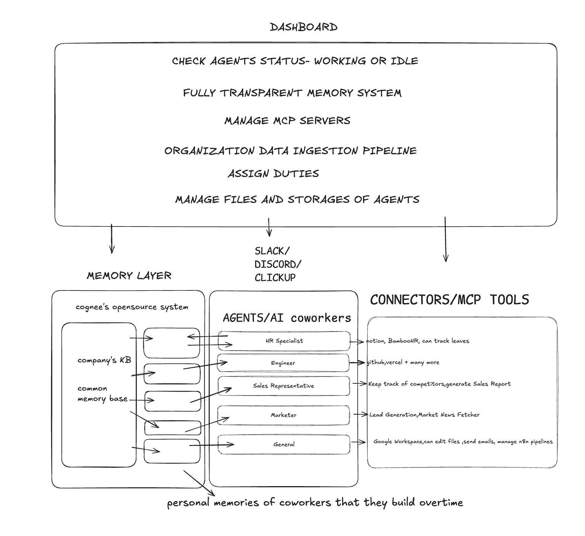

# openhuman

Build your own AI employees. Give them a domain of expertise, feed them your company's knowledge, and they work alongside your team. They remember, they learn over time, and they communicate and actively participate in conversations.

## Architecture

## What you can build

- **A support engineer** that's read every past ticket, runbook, and postmortem. When an incident hits, it recalls exactly how you fixed it last time.
- **An onboarding buddy** that knows your handbook and adapts to every role. New hires ask it anything and get answers drawn from real company context.
- **A product expert** trained on your specs, user research, and customer calls. It surfaces the decision history behind every feature so the team stops re-litigating old debates.
- **A community moderator** that knows your guidelines, keeps conversations healthy, and handles noise before it reaches your team. Consistent enforcement, no burnout.
- **A compliance officer** that's ingested every policy, regulation, and audit finding. It answers regulatory questions and flags gaps before the auditor does.

## How it works

You define an employee's domain of expertise, feed it your documents, policies, conversations, and past decisions, and it learns. [Cognee](https://cognee.ai) builds a living memory graph that grows with every interaction. Your AI employees don't just store information. They connect it, refine it, and get better over time.

They actively communicate through the channels your team already uses: Discord and Slack.

## What makes it different

- **Memory, not just context.** Most AI tools start fresh every conversation. Openhuman employees remember past questions, resolved issues, and decisions your team made six months ago.
- **Expertise you define.** You choose what each employee knows. Sales playbooks, engineering runbooks, legal policies, product specs. Each one becomes deep in its domain.
- **Active, not passive.** They surface knowledge when it's relevant and participate in conversations where they can help. They don't wait to be asked.
- **Learns over time.** Every correction, every new document, every conversation makes them better. The memory graph compounds.
- **Remembers your people.** Your employees know who's who: who led that project, who wrote that doc, who to ask about the payment stack. Org knowledge that doesn't walk out the door.
- **Infinite power via MCP.** Equip any employee with [Model Context Protocol](https://modelcontextprotocol.io) tools: calendars, CRMs, issue trackers, databases, APIs. They gain the ability to *do*, not just answer. Every tool you connect multiplies what they're capable of.

