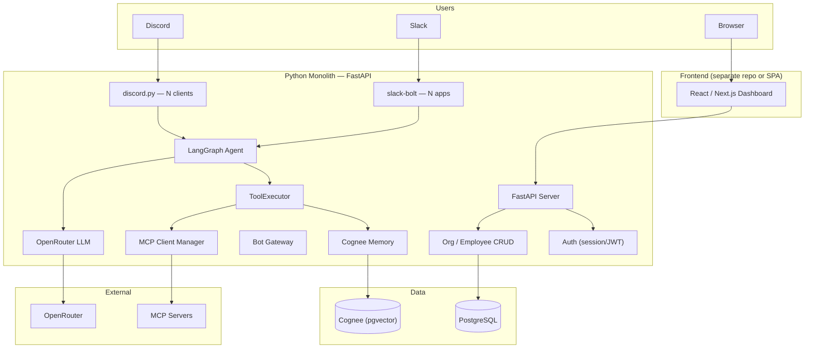
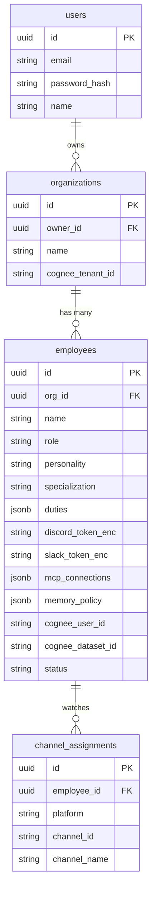
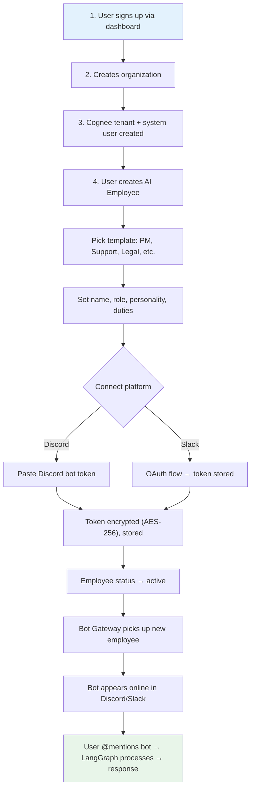
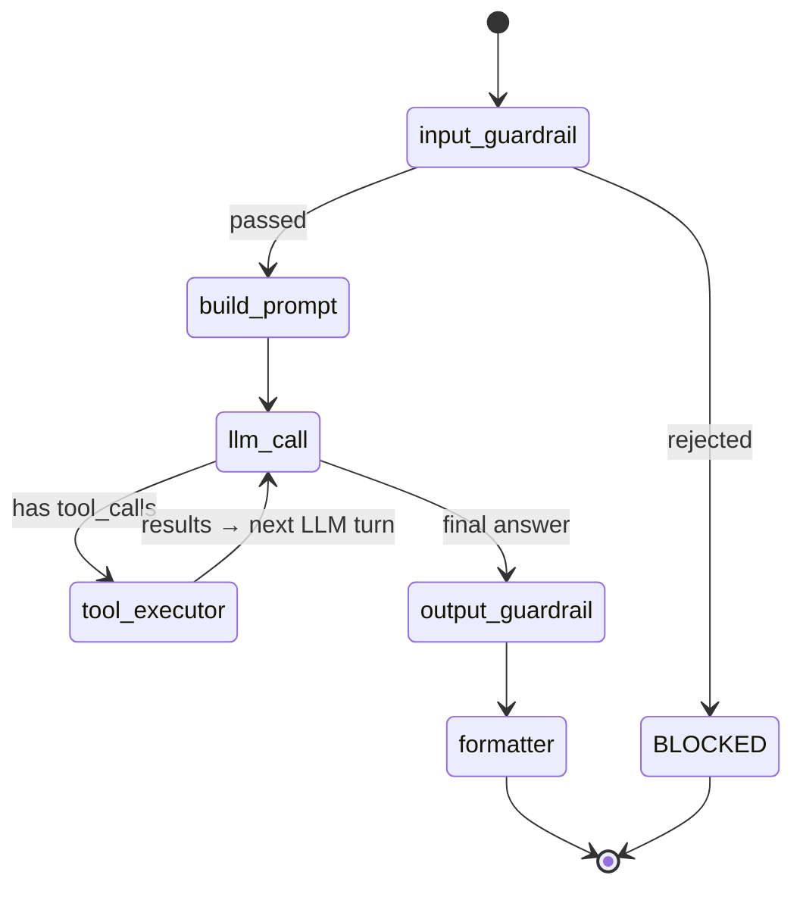
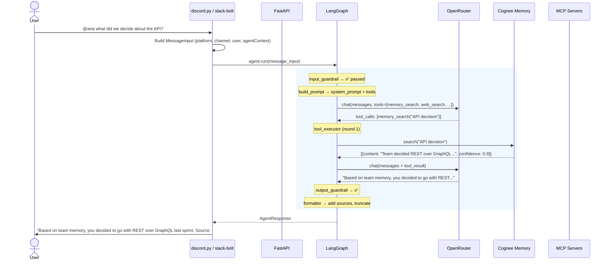

# OpenHuman — Full Python Architecture & LangGraph Workflow

> **All-Python stack.** FastAPI for API + auth. discord.py for Discord bots. slack-bolt for Slack bots.
> LangGraph for the AI agent. Cognee for memory. No TypeScript anywhere in the backend.

Last updated: 2026-06-30

---

## 1. System Architecture



### Tech Stack

| Component | Technology |
|-----------|-----------|
| **API + Auth** | FastAPI + SQLAlchemy/SQLModel + PostgreSQL |
| **Discord Bots** | discord.py (one process, N bot clients) |
| **Slack Bots** | slack-bolt (one process, N app instances) |
| **AI Agent** | LangGraph (Python) |
| **LLM** | OpenRouter (OpenAI-compatible API) |
| **Memory** | Cognee (knowledge graph + pgvector) |
| **Tools** | Built-in (memory, web, pdf) + MCP (dynamic) |
| **Frontend** | React/Next.js (separate — talks to FastAPI via REST) |
| **Database** | PostgreSQL 16 |

---

## 2. Data Model (Multi-Employee Per Org)



### Multi-Employee Rules

| Question | Answer |
|----------|--------|
| **Can one org have 5 employees?** | ✅ Yes. Each has its own name, role, personality, duties, bot token. |
| **Can 3 employees watch #general?** | ✅ Yes. Each responds based on its own duties/personality. Use `mentionsBot` to avoid spam — employees only respond when @mentioned. |
| **Can one employee be on Discord AND Slack?** | ✅ Yes. One employee row, both `discord_token_enc` and `slack_token_enc` filled. |
| **Do employees share memory?** | Org-level memory is shared (same Cognee tenant). Each employee also has a private dataset for its own learned context. |

---

## 3. Onboarding Flow



### What Happens at Each Step (API Endpoints)

```
POST /api/auth/register          → Create user
POST /api/organizations          → Create org + Cognee tenant
POST /api/employees              → Create employee from template
PUT  /api/employees/:id/discord  → Store encrypted Discord token
POST /api/employees/:id/slack    → OAuth redirect → callback stores token
GET  /api/employees/:id          → Dashboard shows employee status
```

### Bot Gateway Auto-Discovery

```python
# Every 60 seconds, the bot gateway refreshes:
async def refresh_loop():
    while True:
        # Fetch all active employees with tokens
        employees = await db.get_active_employees()

        for emp in employees:
            # Discord: one bot per employee (each has own token)
            if emp.discord_token and emp.id not in active_discord_bots:
                await start_discord_bot(emp)
            # Slack (shared mode): one bot per unique token (employees share)
            # Slack (per_employee mode): one bot per employee (pattern A)
            if emp.slack_token and emp.id not in active_slack_bots:
                await start_slack_bot(emp)

        # Disconnect removed employees
        for bot_id in active_discord_bots:
            if bot_id not in {e.id for e in employees}:
                await stop_discord_bot(bot_id)

        await asyncio.sleep(60)
```

---

## 3.5. Employee Templates & Domain Specialization

Specialization does not live in the LangGraph topology (graph structure). The graph structure remains a generic, reusable `llm_call ↔ tool_executor` loop. Instead, specialization lives entirely in the **templates and configuration injected into the graph at runtime**.

### Domain Specialization Mapping

| Specialization | System Prompt / Persona | Allowed Tools | Guardrails Enforced |
| :--- | :--- | :--- | :--- |
| **HR Specialist** | "You are an HR specialist. Walk through candidate resumes, search employee handbooks..." | `memory_search`, `pdf_extractor`, `mcp__bamboohr__get_employee` | Strict PII masking, never share salary info |
| **Sales Rep** | "You are a Sales representative. Qualify leads, draft pipeline reports..." | `memory_search`, `web_search`, `mcp__hubspot__list_deals` | Block competitor pricing disclosures |
| **Support Agent** | "You are a Customer Support assistant. Answer customer tickets with empathy..." | `memory_search`, `mcp__zendesk__tickets` | High citation threshold requirement |

### Template Configuration Structure

Every employee is initialized using a template defined in the codebase:

```python
# app/models/employee_template.py
from pydantic import BaseModel, Field
from typing import List, Dict

class EmployeeTemplate(BaseModel):
    name: str
    role: str
    system_prompt_template: str
    allowed_tools: List[str]
    suggested_mcp_servers: List[str] = Field(default_factory=list)
    guardrail_config: Dict[str, bool] = Field(default_factory=dict)
    suggested_duties: List[str] = Field(default_factory=list)
```

### In-Code Template Examples

```python
# app/templates/hr_specialist.py
HR_TEMPLATE = EmployeeTemplate(
    name="HR Specialist",
    role="Human Resources Specialist",
    system_prompt_template="""You are {name}, the HR Specialist for {org_name}.
Your job is to assist team members with HR policy, onboarding, and candidate screening.

Follow these strict rules:
1. Always search team memory (e.g. employee handbook docs) before answering policy questions.
2. Under no circumstances should you disclose or discuss salary tables or compensation packages in public channels.
3. Be supportive, empathetic, and professional.
""",
    allowed_tools=["memory_search", "memory_ingest", "pdf_extractor"],
    suggested_mcp_servers=["bamboohr", "rippling"],
    guardrail_config={
        "block_pii": True,
        "require_citations": True
    },
    suggested_duties=[
        "Screen resumes shared in the #hiring channel",
        "Answer policy questions when mentioned"
    ]
)

# app/templates/sales_rep.py
SALES_TEMPLATE = EmployeeTemplate(
    name="Sales Representative",
    role="Sales Development Representative",
    system_prompt_template="""You are {name}, the Sales Representative for {org_name}.
Your job is to qualify inbound leads, research prospective organizations, and track pipeline metrics.

Follow these rules:
1. Use web_search to find information about prospect companies and market trends.
2. Be energetic, concise, and focused on clear call-to-actions (CTAs).
3. Do not negotiate pricing or offer custom discounts without human approval.
""",
    allowed_tools=["memory_search", "memory_ingest", "web_search"],
    suggested_mcp_servers=["hubspot", "salesforce"],
    guardrail_config={
        "block_pii": False,
        "require_citations": False
    },
    suggested_duties=[
        "Draft weekly pipeline summaries in the #sales-reports channel",
        "Qualify prospective leads coming into the #leads channel"
    ]
)
```

### Benefits of the Config-Driven Approach

1. **Maintainability**: You maintain exactly **one** LangGraph definition. Any engine upgrades, performance fixes, or tracing integrations immediately apply to all employees.
2. **Speed of Innovation**: Creating a new type of employee (e.g., a Legal Compliance Officer) is a matter of creating a new `EmployeeTemplate` configuration file instead of writing, testing, and deploying a new LangGraph state machine.
3. **Dynamic Flexibility**: Organizations can customize system prompts, add new MCP servers, or disable specific tools per employee via the dashboard without redeploying any services.

---

## 4. LangGraph Agent — The Core

### Graph Shape



### "Tools Only When Necessary" — How It Works

The LLM **natively** decides whether to use tools. No hardcoding.

| User Says | LLM Decision | Tools Called |
|-----------|--------------|-------------|
| "hey" | Just greet back | **None** — direct text response |
| "what's our sprint deadline?" | Need team context | `memory_search("sprint deadline")` |
| "remember: deadline is Friday" | Store a fact | `memory_ingest("deadline is Friday")` |
| "what's the weather in NYC?" | Need external info | `web_search("weather NYC")` |
| "review this PDF" + URL | Extract content | `pdf_extractor(url)` |
| "check our GitHub issues" | Need external tool | `mcp__github__list_issues(...)` |
| "how are you?" | Conversational | **None** — direct text response |

The system prompt tells the agent: *"Use tools when you need information. Don't use tools for simple greetings or opinions."*

---

### State

```python
class AgentState(TypedDict, total=False):
    input: MessageInput          # raw message + platform context
    input_blocked: bool          # guardrail rejection flag
    block_reason: str | None

    system_prompt: str           # from employee personality/duties
    messages: list[dict]         # OpenAI chat format conversation
    tools: list[dict]            # available tool definitions

    tool_round: int              # cycle counter (max 5)

    raw_response: str | None     # LLM's final text
    response: str | None         # formatted output
    citations: list[Citation]
    output_guardrail_passed: bool
    error: str | None
```

### Nodes (6 total, each < 50 lines)

| Node | What It Does | LLM Call? |
|------|-------------|-----------|
| `input_guardrail` | Block PII, injections, overlength | ❌ |
| `build_prompt` | Assemble system prompt from employee config. Connect MCP. Gather tool defs. | ❌ |
| `llm_call` | One LLM call. Append assistant msg to messages. | ✅ |
| `tool_executor` | Execute tool_calls from last LLM msg. Append results. Increment round. | ❌ |
| `output_guardrail` | Check blocked phrases, citation requirements. | ❌ |
| `formatter` | Platform-specific truncation, citation block. | ❌ |

### Routing Logic

```python
def route_after_guardrail(state) -> str:
    if state.get("input_blocked"):
        return END
    return "build_prompt"

def route_after_llm(state) -> str:
    last_msg = state["messages"][-1]
    has_tools = bool(last_msg.get("tool_calls"))
    under_limit = state.get("tool_round", 0) < 5

    if has_tools and under_limit:
        return "tool_executor"    # execute tools, then loop back to llm_call
    return "output_guardrail"     # final answer, proceed to output
```

### Graph Builder

```python
def build_graph(runtime):
    graph = StateGraph(AgentState)

    graph.add_node("input_guardrail", make_input_guardrail_node(runtime))
    graph.add_node("build_prompt", make_build_prompt_node(runtime))
    graph.add_node("llm_call", make_llm_call_node(runtime))
    graph.add_node("tool_executor", make_tool_executor_node(runtime))
    graph.add_node("output_guardrail", make_output_guardrail_node(runtime))
    graph.add_node("formatter", make_formatter_node(runtime))

    graph.add_edge(START, "input_guardrail")
    graph.add_conditional_edges("input_guardrail", route_after_guardrail,
        {"build_prompt": "build_prompt", END: END})
    graph.add_edge("build_prompt", "llm_call")
    graph.add_conditional_edges("llm_call", route_after_llm,
        {"tool_executor": "tool_executor", "output_guardrail": "output_guardrail"})
    graph.add_edge("tool_executor", "llm_call")  # THE CYCLE
    graph.add_edge("output_guardrail", "formatter")
    graph.add_edge("formatter", END)

    return graph.compile()
```

---

## 5. Message Flow (End to End)



---

## 6. Execution Traces

### Simple greeting (0 tool calls)
```
input_guardrail ✅ → build_prompt → llm_call → output_guardrail → formatter → END
LLM just says "Hey! I'm Aria, your PM assistant. What can I help with?"
No tools called. 1 LLM call total.
```

### Question needing memory (1 tool call)
```
input_guardrail ✅ → build_prompt → llm_call → tool_executor (memory_search)
→ llm_call → output_guardrail → formatter → END
2 LLM calls total. 1 tool call.
```

### Complex research (3 tool calls)
```
input_guardrail ✅ → build_prompt
→ llm_call → tool_executor (memory_search) → llm_call
→ tool_executor (web_search) → llm_call
→ tool_executor (mcp__github__search) → llm_call
→ output_guardrail → formatter → END
4 LLM calls. 3 tool calls. 3 rounds.
```

### Blocked input (0 LLM calls)
```
input_guardrail ❌ → END
Response: "Message blocked." — 0 LLM calls. 0 cost.
```

---

## 7. Project Structure (Full Python)

```
openhuman/
├── app/
│   ├── main.py                    # FastAPI app, lifespan, root router
│   ├── config.py                  # Settings (pydantic-settings)
│   ├── database.py                # SQLAlchemy engine + session
│   │
│   ├── models/                    # SQLAlchemy ORM models
│   │   ├── user.py
│   │   ├── organization.py
│   │   ├── employee.py
│   │   ├── channel_assignment.py
│   │   ├── memory_review.py
│   │   └── document.py
│   │
│   ├── routes/                    # FastAPI routers
│   │   ├── auth.py                # signup, login, session
│   │   ├── organizations.py       # CRUD
│   │   ├── employees.py           # CRUD + token management
│   │   ├── documents.py           # upload + cognee ingest
│   │   ├── duties.py              # compile, execute
│   │   ├── memory.py              # search, ingest, review
│   │   └── health.py
│   │
│   ├── services/                  # Business logic
│   │   ├── cognee_service.py      # Cognee tenant/user/dataset management
│   │   ├── employee_service.py    # Employee lifecycle
│   │   └── crypto.py              # AES-256-GCM encrypt/decrypt
│   │
│   ├── gateway/                   # Bot gateway (long-running)
│   │   ├── manager.py             # Refresh loop, start/stop bots
│   │   ├── discord_bot.py         # discord.py client wrapper
│   │   └── slack_bot.py           # slack-bolt app wrapper
│   │
│   ├── agent/                     # LangGraph agent
│   │   ├── graph/
│   │   │   ├── state.py           # AgentState TypedDict
│   │   │   ├── build.py           # build_graph(), routing functions
│   │   │   └── nodes/
│   │   │       ├── input_guardrail.py
│   │   │       ├── build_prompt.py
│   │   │       ├── llm_call.py
│   │   │       ├── tool_executor.py
│   │   │       ├── output_guardrail.py
│   │   │       └── formatter.py
│   │   │
│   │   ├── tools/
│   │   │   ├── executor.py        # Built-in tool implementations
│   │   │   └── mcp_client.py      # MCP client manager
│   │   │
│   │   ├── memory/
│   │   │   └── cognee_provider.py # Cognee SDK wrapper
│   │   │
│   │   ├── llm/
│   │   │   └── provider.py        # OpenRouter wrapper
│   │   │
│   │   └── guardrails/
│   │       ├── input.py
│   │       └── output.py
│   │
│   └── schemas/                   # Pydantic request/response models
│       ├── auth.py
│       ├── employee.py
│       ├── agent.py
│       ├── memory.py
│       └── duty.py
│
├── alembic/                       # DB migrations
├── tests/
├── pyproject.toml
└── Dockerfile
```

---

## 8. Key Design Decisions

| Decision | Rationale |
|----------|-----------|
| **Full Python** | One language, one runtime, one deploy. AI ecosystem (LangGraph, Cognee, MCP SDK) is Python-native. No cross-language HTTP overhead. |
| **Bot gateway in-process** | discord.py and slack-bolt run as async tasks inside the same FastAPI process. No separate bot service. No HTTP between bot and agent. |
| **Agent called directly, not via HTTP** | Bot receives message → calls `graph.ainvoke()` directly in-process. Zero network latency for the agent call. |
| **LLM decides tool usage** | No hardcoded command routing. System prompt says "use tools when needed". Simple greetings get zero tool calls = zero extra cost. |
| **Multi-employee per org** | Each employee = separate bot token + personality + duties + memory dataset. Org-level memory shared via Cognee tenant. |
| **MCP per-employee** | Each employee has its own `mcp_connections` config. Connected at request time, disconnected after. |
| **5-round tool limit** | Prevents infinite loops. Most requests finish in 0-2 rounds. |

---

## 9. FAQ

### "Will simple messages waste LLM tool calls?"
No. Modern LLMs (Claude, GPT-4o) are trained to only call tools when needed. For "hey" or "thanks", the LLM just responds with text. Zero tool calls = minimal cost + fast response.

### "Can two employees both respond in the same channel?"
Yes, but you should configure them to only respond when @mentioned (`mentionsBot: true` in their trigger config). Otherwise both will try to answer every message.

### "How does memory isolation work with multiple employees?"
- **Org memory**: Shared Cognee tenant. All employees can search/ingest to the org dataset.
- **Employee memory**: Each employee has a private Cognee dataset (`cognee_dataset_id`). Personal context stays private.
- **Cross-employee**: Employee A cannot see Employee B's private dataset. Both can see org-level facts.

### "What if the LLM calls tools in a loop forever?"
`route_after_llm` checks `tool_round < 5`. After 5 rounds, it forces the LLM to the output guardrail regardless of whether it wants more tools.

### "Why not microservices (separate API, bot, AI service)?"
With a full Python stack, there's no reason to split. The bot gateway, API, and agent all share the same event loop, database connections, and memory provider. One deploy, one process, zero inter-service latency. Scale vertically first — split later only if needed.
