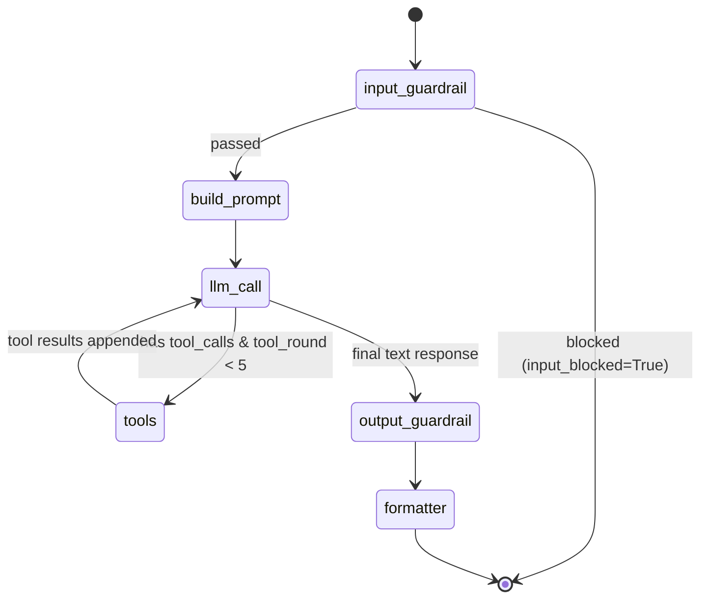

# OpenHuman Agent Orchestration Engine

OpenHuman uses a state-preserving cyclical agent execution flow built on **LangGraph**. Instead of single-turn stateless LLM invocations, the agent can recursively evaluate user queries, decide to execute local tools or remote MCP connections, check on background jobs, apply input/output guardrails, and write responses.

---

## 1. The Agent Graph Topology

The execution flow of the agent is modeled as a compiled `StateGraph`. It ensures that safety and styling checks surround the core LLM execution loop:



### Routing Decisions
1.  **After Input Guardrail (`route_after_guardrail`)**: If `input_blocked` is flagged as `True`, routing immediately jumps to `END`, preventing any costly LLM invocation. Otherwise, execution proceeds to `build_prompt`.
2.  **After LLM Call (`route_after_llm`)**:
    *   If the LLM emits `tool_calls` and the current `tool_round` counter is less than `5`, the graph routes to the `tools` execution node.
    *   If no tool calls are present, or the round counter reaches the hard cutoff of `5` (preventing infinite tool loops), routing transitions to `output_guardrail`.

---

## 2. Graph Nodes & Code Responsibilities

The agent graph registers 6 functional nodes, located under `apps/api/app/agent/nodes/`:

### 1. `input_guardrail`
*   Scans the incoming `HumanMessage` for security and performance risks (e.g. prompt injection, token length overflow, basic PII leaks).
*   Sets `input_blocked = True` and populates `block_reason` if violations occur.

### 2. `build_prompt`
*   Resolves the employee's specialization template (e.g. HR, Sales).
*   Interpolates active system prompt values (inserting name, organization profile metadata).
*   Gathers structural definitions for all allowed built-in and active MCP tools.

### 3. `llm_call`
*   Executes the LLM request via OpenRouter.
*   Binds the allowed tools list to the model instance.
*   Appends the assistant response to the message history.

### 4. `tools` (Custom Tool Node)
*   Iterates over the requested `tool_calls` inside the last `AIMessage`.
*   Executes the matching Python tool functions or calls remote MCP servers.
*   Increments the `tool_round` counter and returns `ToolMessage` outputs.

### 5. `output_guardrail`
*   Audits the generated assistant text for compliance, blocked terminology, and attribution quality.

### 6. `formatter`
*   Performs platform-specific truncation (such as splitting text for Discord's 2000-character limits).
*   Formats citations and adds list headers.

---

## 3. Persistent Checkpointer & Conversation Memory

Rather than rebuilding conversation context from Slack history or sending raw message histories back and forth, OpenHuman integrates an async Postgres checkpointer.

*   **Technology**: `AsyncPostgresSaver` from the `langgraph-checkpoint-postgres` library.
*   **Initialization**: Configured at API startup inside `app/main.py`. The checkpointer writes thread states directly to Postgres tables.
*   **Thread Keys**: Managed dynamically using a composite key:
    ```text
    thread_key = f"{platform}:{employee_id}:{channel_id}"
    ```
*   **State Restoring**: When a bot triggers `graph.ainvoke(..., config={"configurable": {"thread_id": thread_key}})`, LangGraph fetches the conversation checkpoint and merges the incoming message using message reducers (`add_messages`).

---

## 4. Asynchronous Task Queue (`app/agent/jobs/`)

To support heavy tasks without blocking gateway event loops (such as analyzing large PDFs or scraping websites), OpenHuman splits execution into an async database-backed job queue.

### Enqueue Tool Pattern (Non-blocking)
Heavy tools (e.g., `analyze_document`) do not block during the graph execution. Instead:
1.  The tool writes a `pending` job row into the `agent_jobs` table.
2.  It returns a lightweight JSON ticket containing the `job_id` and a status message.
3.  The agent graph quickly finishes, and the bot replies immediately: *"I'm analyzing that document in the background. I'll let you know when I'm done."*

### Concurrent Processing & Thread Locking
The `AgentJobWorker` pool spins up multiple parallel worker loops that query the database to claim tasks:

*   **Claiming Query**:
    ```sql
    SELECT * FROM agent_jobs
    WHERE status = 'pending'
      AND thread_key NOT IN (
          SELECT thread_key FROM agent_jobs 
          WHERE status IN ('running', 'awaiting_approval')
      )
    ORDER BY created_at
    FOR UPDATE SKIP LOCKED LIMIT 1;
    ```
*   **Thread Serialization**: The `NOT IN` filter ensures that if multiple background jobs are enqueued in the same conversation thread, they are executed in a sequential FIFO order, avoiding race conditions or out-of-order notifications.
*   **Job Completion**: Once the background worker completes the execution, it accesses the employee's encrypted platform token and uses the platform's API client (e.g. `chat.postMessage`) to push the final summary directly back to the original thread.

### Task Control Tools
*   `check_background_task`: The agent can invoke this tool mid-conversation to query active background jobs for the current thread, allowing it to answer queries like *"How is the PDF analysis going?"*
*   `cancel_background_task`: Flags a job as `cancelled` in the database and cancels the active asyncio future in the worker pool.
