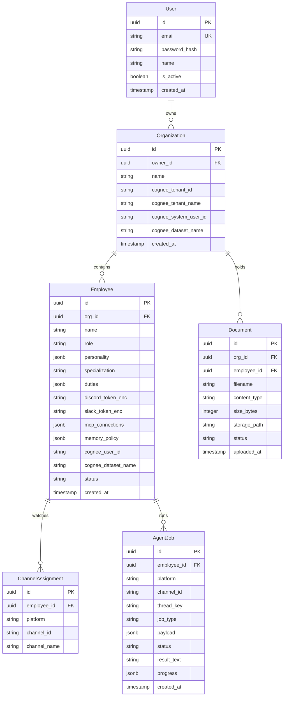

# OpenHuman Backend Architecture

The backend of OpenHuman is written in Python using the **FastAPI** framework. It acts as a REST API gateway for the Next.js dashboard, drives the LangGraph multi-agent execution loop, maintains WebSocket clients via the bot gateway, and manages persistent cognitive memory indexing through Cognee.

---

## 1. Directory Blueprint

All backend source files reside inside `apps/api/app/`. The structure is co-located by domain rather than split by pattern (e.g., all models, schemas, and routes for `employees` are housed in the same folder):

```text
apps/api/app/
├── core/                       # Core configurations & utilities
│   ├── config.py               # Pydantic Settings & environment variables validation
│   ├── database.py             # Async SQLAlchemy engine & session lifecycle
│   ├── security.py             # Cryptography (JWT, Bcrypt, AES-256-GCM)
│   └── dependencies.py         # Shared FastAPI Dependency Injectors
│
├── auth/                       # User management & session flow
│   ├── models.py               # SQLAlchemy User table
│   ├── schemas.py              # Auth request & response schemas
│   ├── service.py              # Password matching & user registry
│   └── router.py               # endpoints (/register, /login, /me)
│
├── organizations/              # Organization management
│   ├── models.py               # Org table (linked to owner user & Cognee tenant)
│   ├── schemas.py              # Organization payloads
│   ├── service.py              # Org CRUD & Cognee tenant creation hook
│   └── router.py               # CRUD endpoints (/api/organizations)
│
├── employees/                  # AI Employees
│   ├── models.py               # Employee profile, status, keys, and slot details
│   ├── schemas.py              # Employee configuration payloads
│   ├── service.py              # Employee lifecycle & token encryption handlers
│   ├── templates.py            # Predefined base templates (HR, Sales, Support)
│   └── router.py               # Endpoints nested under organizations
│
├── channel_assignments/        # Employee platform channels mapping
│   ├── models.py               # ChannelAssignment table
│   ├── schemas.py              # Mapping requests
│   └── router.py               # Channel association endpoints
│
├── documents/                  # Document uploads for indexing
│   ├── models.py               # Document metadata mapping
│   ├── schemas.py              # Document list structures
│   ├── service.py              # Local/S3 storage write & Cognee background index trigger
│   └── router.py               # Multi-part upload endpoints
│
├── storage/                    # Storage backends
│   ├── base.py                 # Abstract StorageBackend interface
│   ├── local.py                # Local Disk storage implementation
│   └── s3.py                   # AWS S3 / Cloudflare R2 client implementation
│
├── main.py                     # Entry point (fastapi app, lifespan, CORS, error handling)
└── routes/                     # Central routing consolidation
```

---

## 2. Configuration System (`core/config.py`)

OpenHuman uses `pydantic-settings` to load configurations from environment variables or a `.env` file at app startup. 

### Key Config Variables

*   **Server Config**: `api_host` (default `0.0.0.0`), `api_port` (default `8000`), `cors_origins`.
*   **Database Config**: `database_url` (async pgvector driver `postgresql+asyncpg://...`), `db_pool_size`, `db_max_overflow`.
*   **Security Secrets**: `jwt_secret_key` and `encryption_key`. In production, these are strictly validated: the JWT secret must be at least 32 characters, and `encryption_key` must be a 64-hex-character string (representing a 32-byte key) or startup fails.
*   **Agent Concurrency**: `agent_worker_concurrency` (threads running background task workers) and `agent_job_poll_interval_seconds` (polling rate of the jobs table).
*   **Cognee Vector Database**: `cognee_data_dir` (directory for LanceDB, SQLite, and Kuzu database files), LLM and Embedding provider settings (OpenAI/OpenRouter configurations).
*   **Platform Slack Modes**: `slack_identity_mode` (`"shared"` vs `"per_employee"`).

---

## 3. Cryptography & Security Layer (`core/security.py`)

To ensure tenant security, OpenHuman encapsulates standard authentication and symmetric token encryption:

### JWT Auth & Password Hashing
*   **Password Hashing**: Uses `passlib.context.CryptContext` configured with `bcrypt` to hash user passwords before storing.
*   **JWT Token Handling**: Uses `python-jose` to generate signed access tokens upon login, embedding the User ID as the payload sub.

### Encrypted Tokens at Rest (AES-256-GCM)
Because AI employees require Discord and Slack bot tokens to connect on behalf of organizations, OpenHuman encrypts all API credentials before saving them to PostgreSQL.
*   **Encryption Standard**: AES-256-GCM (Galois/Counter Mode) via Python's `cryptography.hazmat` package.
*   **Encryption Key**: Sourced from `settings.encryption_key`.
*   **Structure**: Every encrypted record stores a 12-byte random Initialization Vector (IV), the raw GCM ciphertext, and a 16-byte authentication tag, combined into a base64-encoded string.

---

## 4. Core Database Schema & Relationships

The database is built on **SQLAlchemy 2.0** using async session handlers. Below is the Entity Relationship diagram showing how tenants are structured:



---

## 5. Storage Subsystem (`storage/`)

Documents uploaded to OpenHuman are managed by a storage provider interface. This keeps file uploads decoupled from database transactions.

*   **LocalStorageBackend**: Saves documents to local directories under `./uploads/{org_id}/`. Used primarily for development.
*   **S3StorageBackend**: Directly interacts with S3-compatible cloud buckets (AWS S3, Cloudflare R2, MinIO, etc.) using `aioboto3`. Supplying bucket configurations automatically uploads files to object storage with UUID prefixes to avoid filename collisions.

---

## 6. Alembic Migrations

The database migration schema is controlled by Alembic, enabling hot-reloading migrations. 

*   **Autogenerate configuration**: `alembic/env.py` registers the async PG connection string and imports all SQLAlchemy domain models (`User`, `Organization`, `Employee`, `ChannelAssignment`, `Document`, `AgentJob`) so database schemas remain aligned with ORM class declarations.
*   **Execution Commands**:
    ```bash
    # Generate a migration file after altering a model
    uv run alembic revision --autogenerate -m "describe_change"

    # Apply all migrations to the database
    uv run alembic upgrade head
    ```
