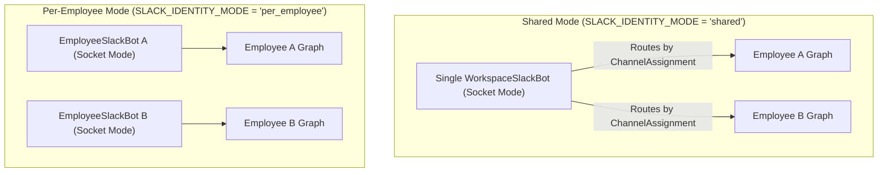

# Chat Integration & Bot Gateway

OpenHuman enables organizations to interact with their AI employees directly inside Slack and Discord. The gateway operates **in-process**, managing long-running WebSocket client connections alongside the core FastAPI server to eliminate latency between platform events and agent graph execution.

---

## 1. Gateway Lifecycle & Reconciliation (`BotGatewayManager`)

The connection manager resides in `app/gateway/manager.py` and coordinates the active state of all running bot threads:

*   **Initialization**: Instantiated during the FastAPI application lifespan. If `gateway_enabled` is set to `True` in settings, `BotGatewayManager.start()` is triggered.
*   **Reconciliation Loop**: Runs a background poll every 60 seconds:
    1.  Queries the database to fetch active employees with decrypted access tokens (`get_active_employees_with_tokens`).
    2.  Compares this set with currently connected Discord and Slack WebSockets.
    3.  **Start Connection**: Launches new async task loops for newly active employees or updated credentials.
    4.  **Stop Connection**: Gracefully disconnects WebSockets and cancels tasks for employees who are deleted, set to `inactive`, or whose tokens fail decryption.
*   **Retry Mechanisms**: Connection setups are protected by exponential backoff (e.g. 10s, 20s, 40s) up to 3 retry attempts to prevent rate-limiting lockouts during vendor outages.

---

## 2. Discord Bot Engine (`gateway/discord_bot.py`)

The Discord integration is written using `discord.py` and maps **one Discord bot token to one AI Employee**:

*   **Identity Mapping**: Each employee possesses a dedicated Discord app identity. The bot has its own avatar, description, username, and role mapping.
*   **Trigger Filters**: To avoid channel spam, `EmployeeDiscordBot` implements strict message intercepts:
    *   **Direct Messages (DMs)**: Always processed.
    *   **Public Mentions**: Processed only if the message directly @mentions the bot's user ID.
*   **Scope (Channel Assignments)**: If the employee is assigned specific channels, the bot ignores messages from any other channel. If no channel assignments exist, it responds to DMs and @mentions across the entire server.

---

## 3. Slack Bot Engine (`gateway/slack_bot.py`)

Slack bot operations use `slack-bolt`'s `AsyncApp` running over **Socket Mode**. Depending on organization settings, the system handles Slack identity in one of two modes:



### Shared Identity Mode (`shared`)
*   **Concept**: One single Slack bot application represents the entire organization's AI employee team.
*   **Routing**: The `WorkspaceSlackBot` listens to a single Socket Mode stream:
    1.  Receives messages from public channels or DMs.
    2.  Resolves who to run by matching the active channel ID to `ChannelAssignment` DB rows.
    3.  Spawns the matching `employee_id` graph.
    4.  Replies to the channel using the specific employee's name and avatar overrides.

### Per-Employee Identity Mode (`per_employee`)
*   **Concept**: Each AI Employee acts as a separate, isolated Slack Application.
*   **Routing**: The manager spawns an `EmployeeSlackBot` client for every employee. Each employee has an independent sidebar entry, custom DMs, and @mentions. Channels are filtered using the employee's allowlist.

---

## 4. Message Ingestion & Event Intercepts

The bot gateway performs auxiliary operations on incoming events before running the LLM:

### Automatic Memory Ingestion
Every incoming conversation event that passes channel filters is asynchronously ingested into Cognee's organization dataset:
```python
ingest_text = f"Slack message from <@{speaker}> in <#{channel}>:\n{text}"
await remember(ingest_text, org_dataset, org_system_user, background=True)
```
This guarantees the organization's knowledge base builds a continuous log of chat history context without requiring manual ingestion.

### Cancel Keyword Bypass
If an incoming message matches cancellation intent (e.g. contains "cancel", "stop that", or "nevermind"):
1.  The bot bypasses the LangGraph execution.
2.  It queries `agent_jobs` for any running tasks linked to the current `thread_key`.
3.  Cancels the tasks, deletes them from the worker's active queue, and posts a confirmation in the thread.

---

## 5. Human-in-the-Loop Escalation Buttons

During interactive escalation flows, managers make approval decisions directly inside the chat interface using Slack Block Kit interactive buttons (Approve/Deny):

1.  **Block Kit Delivery**: The escalation tool posts approval blocks containing the `thread_key` and reason.
2.  **Socket Mode Hook**: Button clicks trigger `app.action("escalation_approve")` or `app.action("escalation_deny")` payloads over the existing WebSocket connection.
3.  **Graph Resumption**: The bot captures the action, ack's it, and resumes the paused LangGraph run:
    ```python
    await graph.ainvoke(Command(resume={"approved": True}), config=config)
    ```
4.  **Interface Updates**: The manager's block layout updates to display the resolution status (e.g., *"✅ Approved by @Manager"*), and the final agent response is posted to the user's thread.
