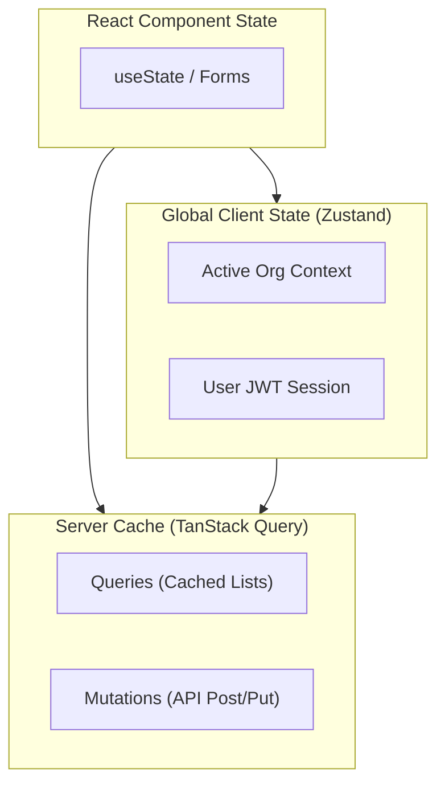
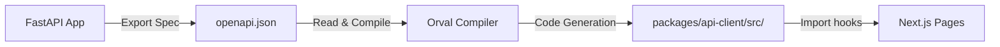

# OpenHuman Frontend Architecture

The frontend of OpenHuman is a React web application built on **Next.js (App Router)** and styled using **Tailwind CSS v4** and **shadcn/ui**. It serves as an administrative control center where users manage organizations, customize AI employees, upload vector knowledge bases, connect platform channels, link Model Context Protocol (MCP) integrations, and monitor live agent activity.

---

## 1. Directory Structure

The frontend application code is located in `apps/web/` and organized as follows:

```text
apps/web/
├── app/                        # Next.js App Router Page Tree
│   ├── (marketing)/            # Landing page and pricing routes
│   ├── (auth)/                 # Login and Signup pages
│   ├── (dashboard)/            # Core dashboard workspace
│   │   ├── _components/        # Dashboard layout shells, sidebar navigation
│   │   ├── dashboard/          # Analytics overview and metrics
│   │   ├── organization/       # Organization and employee settings
│   │   ├── storage/            # Document uploads, S3 logs, scrape triggers
│   │   ├── settings/           # Global preferences and credentials
│   │   └── activity/           # Live agent audit trails
│   ├── setup/                  # First-time user onboarding wizard
│   ├── layout.tsx              # Main entry point layout
│   └── globals.css             # Base styles, Tailwind imports, CSS variables
│
├── components/                 # Shared UI elements (shadcn library primitives)
│   ├── ui/                     # Button, Input, Dialog, Table, Form, Card, Tooltip, etc.
│   └── theme-provider.tsx      # Dark Mode contextual loader
│
├── hooks/                      # Custom hooks (e.g. use-toast, use-mobile)
├── lib/                        # Client libraries & fonts configuration
│   └── api/                    # Custom API wrapper settings
│       └── client.ts           # Axios or fetch instance setups
│
├── stores/                     # Zustand stores for client state management
│   ├── use-org-store.ts        # Tracks active organization contexts
│   └── use-auth-store.ts       # Manages user session state and active tokens
│
└── components.json             # shadcn/ui framework metadata
```

---

## 2. Route Groups & Core Views

The application employs Next.js Route Groups to separate layout wrappers and logic:

### Marketing (`(marketing)`)
*   **Purpose**: Public-facing landing pages presenting OpenHuman capabilities.
*   **Aesthetics**: Sleek grids, dark mode color schemes, animated text trails (Framer Motion / GSAP), and quick overview carousels.

### Authentication (`(auth)`)
*   **Pages**: `/login` and `/signup`.
*   **Behavior**: Submits credentials to backend authentication routes, retrieves a JWT token, writes it to cookies/localStorage, and redirects users to the workspace.

### Workspace Setup (`setup`)
*   **Purpose**: Triggered when a new user registers but doesn't have an active organization.
*   **Flow**: Step-by-step layout requesting organization name, initial domain website (for ScrapeGraphAI crawl), and creation of the first AI Employee.

### User Dashboard (`(dashboard)`)
The central workspace workspace is split into distinct panels:
1.  **Dashboard Hub (`/dashboard`)**: Displays high-level analytics, active employee statuses, and live message counters.
2.  **Employees & Teams (`/organization`)**: Manage employees. Allows configuring roles, personality prompts, duties list, and platform bot tokens (with key-paste forms).
3.  **Storage Hub (`/storage`)**: Upload manuals, texts, or enter scrape targets. Shows the file catalog, file sizes, upload timestamps, and indexing statuses.
4.  **Activity Logs (`/activity`)**: Renders real-time audits of agent tasks, listing queries, which tools were invoked (e.g., AST calculation, web search), execution speeds, and result payloads.

---

## 3. State Management

OpenHuman splits state into local, global client-side, and remote server-side categories:



### Global Client State (Zustand)
Zustand is used to manage transient global UI values that don't need complex database cache invalidation.
*   `useAuthStore`: Manages the active user's details, logged-in status, and JWT access token.
*   `useOrgStore`: Holds the active organization context, ensuring that switching organizations in the sidebar instantly updates all loaded employees and files.

### Server State (TanStack Query)
TanStack React Query handles all server-side caching, background refetching, and transaction loading.
*   Provides automated retry loops for transient API connections.
*   Coordinates cache invalidation (e.g., uploading a document invalidates the query for the document list, triggering a background refetch).

---

## 4. API Client & Orval Code Generation

Frontend interaction with the FastAPI backend is mediated by a type-safe client located in `packages/api-client`.



### Generator Configuration (`orval.config.ts`)
Orval reads the backend's OpenAPI specification (`openapi.json`) and generates:
1.  **TypeScript Contracts**: All request bodies, parameters, and response schemas are generated as TS interfaces under `src/schemas/`.
2.  **React Query Hooks**: Endpoints are compiled into custom hooks (e.g., `useRunAgent`, `useListEmployeesQuery`) under `src/api/`.

### Custom Request Mutator (`custom-instance.ts`)
Rather than using standard Axios calls, Orval is configured to use a custom client instance mutator:
*   **JWT Header Injection**: Checks the active Zustand/Cookie auth state and dynamically injects `Authorization: Bearer <token>` into every request header.
*   **Base URL Routing**: Automatically targets the backend API host based on environment variables.
*   **Unified Error Handling**: Intercepts HTTP 401s to log the user out and clean local cache contexts.
