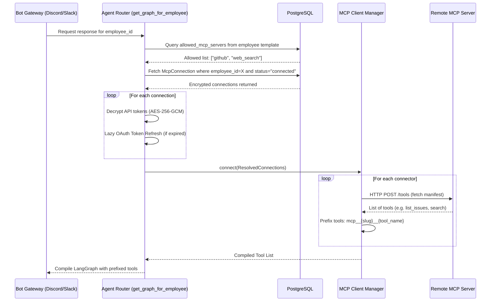

# Model Context Protocol (MCP) Integration

OpenHuman uses the **Model Context Protocol (MCP)** to allow AI employees to communicate with external applications and APIs (such as GitHub, Notion, Vercel, or custom web search services). The connector architecture is **declarative and config-driven**: adding new connectors requires adding a simple metadata spec to the registry.

---

## 1. Declarative Connector Specification (`ConnectorSpec`)

Every MCP server connection is defined using a Pydantic model (`app/agent/tools/mcp/connectors/spec.py`):

*   **Identity**:
    *   `slug`: Unique key used in lookups and database records.
    *   `name`: Human-readable name displayed on the dashboard.
    *   `description`: Summary of capabilities.
*   **Networking**:
    *   `base_url`: Host location of the MCP server.
    *   `transport`: Transport protocol (e.g. `streamable_http` or `sse`).
*   **Authentication**:
    *   `auth_type`: `none`, `api_key_header`, `pat_bearer`, or `oauth2`.
    *   `authorize_url` & `token_url`: OAuth authorization parameters.
    *   `default_scopes`: Requested OAuth permissions list.
*   **Tool Filtering**:
    *   `default_tool_allow`: Restricts tools to an allowed subset before exposing them to the agent.
    *   `default_tool_deny`: Excludes specific tool names from execution.
*   **Resilience & Hardening**:
    *   `request_timeout_seconds`: Timeout limit for calling a tool (defaults to `30.0`s).
    *   `rate_limit_per_minute`: Call limits per client connection (defaults to `60`).
    *   `supports_token_refresh`: True if the OAuth2 server issues refresh tokens.

---

## 2. Authentication Flow Matrix

OpenHuman handles different credential categories based on the connector's configuration:

| Auth Type | Credential Used | Storage Location | Setup Steps |
| :--- | :--- | :--- | :--- |
| **`none`** | None | N/A | None. Immediately available to all employees. |
| **`api_key_header`** | API Key String | `credentials_enc` in DB (AES-256-GCM) | Admin pastes key into dashboard connector form. |
| **`pat_bearer`** | Personal Access Token | `credentials_enc` in DB (AES-256-GCM) | Admin pastes PAT token into dashboard connector form. |
| **`oauth2`** | OAuth Access & Refresh tokens | `credentials_enc` & `oauth_refresh_token_enc` | Redirects to vendor consent screen -> exchanges code -> saves tokens. |

### Lazy Token Refresh
For OAuth2 connections that support refresh tokens, the agent performs a lazy refresh during tool resolution:
1.  Prior to establishing a tool session, the manager checks if the active access token is expired.
2.  If expired, it calls `refresh_access_token()` using the connector's `token_url` and the employee's encrypted client secret.
3.  The database record is updated and committed before loading tools.

---

## 3. Dynamic Tool Resolution Lifecycle

During an agent invocation, tools are resolved dynamically for the calling employee:



---

## 4. Connector Registry (`registry.py`)

To add a new connector to the monorepo, developers complete three declarative steps:

### Step 1: Create the connector spec file
Add a new Python file in `app/agent/tools/mcp/connectors/`, e.g., `hubspot.py`:
```python
from app.agent.tools.mcp.connectors.spec import ConnectorSpec

HUBSPOT_CONNECTOR = ConnectorSpec(
    slug="hubspot",
    name="HubSpot",
    description="Sync and query deals, contacts, and companies",
    base_url="https://mcp.hubspot.com/v1",
    auth_type="oauth2",
    authorize_url="https://app.hubspot.com/oauth/authorize",
    token_url="https://api.hubapi.com/oauth/v1/token",
    default_scopes=["contacts", "deals"],
    docs_url="https://developers.hubspot.com/"
)
```

### Step 2: Register in `registry.py`
Import and add the spec to the `REGISTRY` mapping:
```python
from app.agent.tools.mcp.connectors.hubspot import HUBSPOT_CONNECTOR

REGISTRY: dict[str, ConnectorSpec] = {
    # Existing connectors
    "web_search": WEB_SEARCH_CONNECTOR,
    "github": GITHUB_CONNECTOR,
    # New connector
    "hubspot": HUBSPOT_CONNECTOR,
}
```

### Step 3: Populate Client Credentials (OAuth only)
For OAuth connectors, add the client credentials to `app/core/config.py` following the slug naming convention:
```python
hubspot_client_id: str = ""
hubspot_client_secret: str = ""
```
Then define `HUBSPOT_CLIENT_ID` and `HUBSPOT_CLIENT_SECRET` in your deployment environment variables.

---

## 5. Resilience Controls (Circuit Breakers & Timeouts)

Every active MCP server connection is wrapped in a resilience middleware:

*   **Request Timeouts**: Prevents hanging requests by enforcing a per-call timeout limit (defaulting to 30 seconds).
*   **Circuit Breakers**: If a server experiences 3 consecutive failures (e.g., HTTP 500s or timeouts), the circuit opens for 30 seconds. During this cooldown:
    1.  The connector is skipped during tool loading.
    2.  Attempts to invoke its tools raise a `RuntimeError` immediately, preventing latency build-up.
    3.  The agent graph runs with the remaining healthy tools.
*   **Rate Limiting**: Limits requests to `rate_limit_per_minute` (default 60 calls/minute) using a sliding window token bucket algorithm.
