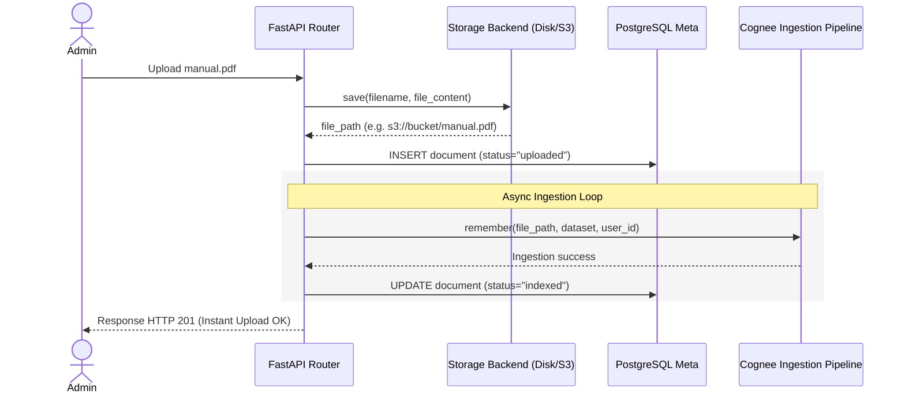

# Cognee Multi-Tenant Memory System

OpenHuman integrates a multi-tenant cognitive memory system powered by the **Cognee SDK**. Memory is managed in-process (embedded) and stores files, conversations, websites, and agent notes as a structured knowledge graph backed by vector embeddings.

---

## 1. Embedded vs. Remote Deployment

Rather than managing an external Cognee Docker container and routing queries over REST, OpenHuman runs Cognee **embedded** within the FastAPI backend process:
*   **Vector Engine**: LanceDB (local vector storage).
*   **Graph Engine**: Kuzu (embedded graph database).
*   **Metadata DB**: SQLite.
*   **Persistence**: All directories are written to `./cognee_data`. In production environments, this folder must be mounted as a persistent volume.

---

## 2. Multi-Tenant Dataset Topology

To support isolated workspaces with multiple employees, OpenHuman establishes a hierarchical access permission topology:

```text
Admin Superuser
  └── Tenant (Acme Corp)
        ├── System User -> Dataset [company-{tenantId}] (shared org context)
        │
        ├── Employee "A" User -> Dataset [employee-{empUuidA}] (private memory)
        │     └── Read Access: [employee-{empUuidA}] + [company-{tenantId}]
        │
        └── Employee "B" User -> Dataset [employee-{empUuidB}] (private memory)
              └── Read Access: [employee-{empUuidB}] + [company-{tenantId}]
```

### Dataset Rules
1.  **Organization Dataset (`company-{tenantId}`)**: Contains global files, company handbooks, and public Slack channel logs. Accessed by all organization employees.
2.  **Employee Dataset (`employee-{empUuid}`)**: Serves as the agent's private scratchpad. Stores facts learned during conversation and private files. Employee B cannot access Employee A's dataset.
3.  **Inherited Read Permission**: During initialization, Cognee uses internal tenant permission controls to grant the employee user read access to the organization's dataset.

---

## 3. Two-Step Document Ingestion Pipeline

To prevent data loss from indexing failures, OpenHuman separates document uploads into two stages:



### Step 1: Storage Backend Write
*   The raw document is written to the active `StorageBackend` (local directory or an S3 bucket).
*   A database record is added with `status="uploaded"`.
*   If downstream indexing crashes, the file remains safe in storage.

### Step 2: Background Cognee Indexing
*   Once the file is saved, a best-effort background call triggers `cognee.remember()` using the file's path.
*   Cognee natively parses multiple file formats (PDF, DOCX, XLSX, TXT, HTML, JSON, markdown) and chunks, embeds, and indexes the content.
*   Once completed, the database status updates to `indexed`.

---

## 4. Web Scraping & ScrapeGraphAI Enrichment

If a `website_url` is provided during organization registration or update:
1.  The backend calls `scrape_and_add()` from the ScrapeGraphAI integration task.
2.  The scraper crawls the target website, extracting key details (business descriptions, services, mission statements).
3.  The extracted data is ingested directly into the organization's `company-{tenantId}` dataset under the system user's context.
4.  This enrichment is best-effort: if the site blocklist rejects the crawler or the scrape fails, organization creation completes successfully without blocking.

---

## 5. Agent Memory Tools

The LangGraph agent interacts with Cognee using two tools:

### `search_memory`
*   **Scope**: Queries both the employee's personal dataset (`employee-{empUuid}`) and the organization-wide dataset (`company-{tenantId}`).
*   **Output**: Returns relevant chunks tagged with their source dataset, allowing the LLM to identify whether a fact is a private note or corporate policy.

### `ingest_memory`
*   **Scope**: Writes facts directly to the employee's personal dataset (`employee-{empUuid}`).
*   **Behavior**: Executes synchronously within the agent run to ensure the newly stored facts are immediately available in the next tool execution round.
