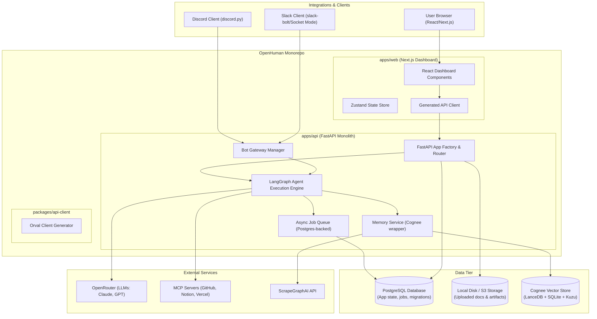

# OpenHuman Architecture Overview

OpenHuman is an open-source, multi-agent workspace coordination framework designed to run autonomous AI employees with custom personalities, specialized roles, and private memory systems. It integrates Slack, Discord, and custom frontends with a robust FastAPI backend, LangGraph-driven execution loops, Model Context Protocol (MCP) connectors, and Cognee-based cognitive memory.

---

## 1. System Topology

OpenHuman is structured as a monorepo containing both the frontend and backend applications, along with shared libraries. 



---

## 2. Monorepo Structure

The workspace is organized as follows:

```text
openhuman/
├── apps/
│   ├── api/                   # FastAPI Backend
│   │   ├── alembic/           # Alembic Database Migrations
│   │   ├── app/               # Main Application Source Code
│   │   │   ├── agent/         # LangGraph Orchestration & Task Worker
│   │   │   ├── auth/          # Authentication Services & Session Management
│   │   │   ├── core/          # Configurations, Security, and Database Connectors
│   │   │   ├── gateway/       # Discord & Slack Bot Gateway Manager
│   │   │   ├── mcp/           # Model Context Protocol Router & OAuth Handlers
│   │   │   ├── memory/        # Cognee Cognitive Memory Provider
│   │   │   └── routes/        # Router registrations (Orgs, Employees, Docs)
│   │   ├── tests/             # Pytest Suite
│   │   ├── Dockerfile         # Python Production Dockerfile
│   │   └── pyproject.toml     # uv Dependency Configuration
│   │
│   └── web/                   # Next.js Frontend
│       ├── app/               # Next.js App Router Pages
│       ├── components/        # UI Component Library (shadcn/ui based)
│       ├── hooks/             # Custom React Hooks
│       ├── lib/               # Utility scripts & API initialization
│       ├── stores/            # Zustand State Stores
│       └── package.json       # Node Dependency Configuration
│
├── packages/
│   └── api-client/            # Shared API Client
│       ├── src/               # Generated TypeScript API contracts (Orval)
│       └── package.json       # Package configuration
│
├── docs/                      # Original Architectural Blueprints & Plans
├── bun.lock                   # Bun lockfile (turborepo orchestrator)
├── package.json               # Monorepo Workspace configuration
└── turbo.json                 # Turborepo Build Pipelines
```

---

## 3. Technology Stack

OpenHuman leverages modern, performant libraries across all levels of the application:

| Layer | Component | Technology | Rationale |
| :--- | :--- | :--- | :--- |
| **Monorepo** | Task Runner | **Turborepo + Bun** | Extremely fast builds, shared workspace tasks, and dependency lock compilation. |
| **Frontend** | Application Framework | **React / Next.js (App Router)** | Static site generation, route optimization, React Server Components compatibility. |
| **Frontend** | Styling & UI | **Tailwind CSS + shadcn/ui** | Rapid, polished UI design with customizable, primitive UI components. |
| **Frontend** | State Management | **Zustand** | Lightweight, boilerplate-free client state synchronization. |
| **Backend** | REST API Engine | **FastAPI** | High-performance asynchronous requests, auto-generated Swagger UI, robust type validation. |
| **Backend** | Package Manager | **uv (astral)** | Near-instant Python virtual environment sync and dependency resolution. |
| **Backend** | ORM & Migrations | **SQLAlchemy 2.0 & Alembic** | Type-safe SQL mappings, async database driver capabilities, structured schema versioning. |
| **Backend** | Agent Graph | **LangGraph (Python)** | State-preserving cyclical agent execution flows. |
| **Backend** | Cognitive Memory | **Cognee** | Hybrid knowledge graph, vector indexing, and automatic entity extraction. |
| **Database** | Core Data Store | **PostgreSQL 16** | Industrial-grade reliability, transactional support for queueing and checkpointing. |
| **Chat Clients** | Gateway Bots | **discord.py & slack-bolt** | Native WebSocket listeners (Socket Mode on Slack) ensuring low-latency gateway communication. |

---

## 4. Fundamental Design Choices

### Python-Native Backend
All AI services, database interactions, cognitive indexing, and webhook gateways run within a single Python runtime. This avoids network serialization overhead between TypeScript-to-Python bridges and allows the agent logic, memory tools, and Discord/Slack clients to execute in the same event loop.

### Single-Process Bot Gateway
Rather than running a fleet of external microservice containers for each bot instance, OpenHuman runs a unified gateway manager inside the main FastAPI application lifecycle. It dynamically hooks into active database configs and connects/disconnects WebSocket clients using async tasks.

### Asynchronous Tool execution
Heavy tasks (e.g. PDF analysis or web crawling) are handled asynchronously. If a tool requires more than a few seconds, it enqueues a database job and immediately completes the graph run, freeing the bot connection. An independent worker pool picks up the job and posts the results back to the thread when finished.
