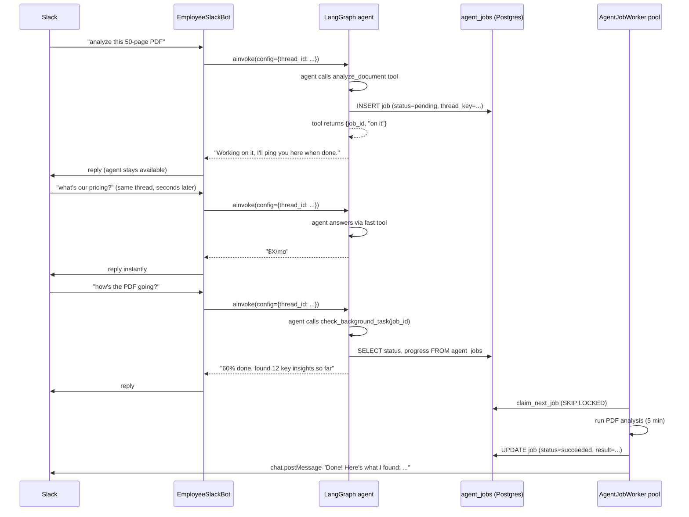

# Async Agents, Concurrency Control, and Human-in-the-Loop Escalation

> Add a Postgres-backed async job queue so employees can run multi-minute tasks without blocking Slack Socket Mode, serialize/cancel concurrent requests per conversation thread, add a LangGraph Postgres checkpointer for thread memory and pause/resume, and add an `escalate_to_human` tool with fire-and-forget and interactive-approval modes.

## Key architectural decision: tool-level dispatch, not invocation-level blocking

The agent graph **never blocks for minutes**. Heavy tools (PDF analysis, knowledge-base search, etc.) enqueue work into the job table and return a `job_id` immediately. The graph completes in under a second, the agent replies "on it," and stays available for the next message. Background workers pick up the job, do the real work, and post results back to Slack via `chat_postMessage`. This means:

- **No invocation-level queueing.** The graph stays fast, the checkpointer preserves context across invocations, and only the heavy tool execution goes async.
- **The agent is always responsive.** A 5-minute PDF analysis never locks the user out.
- **Progress is queryable.** A `check_background_task` tool lets the agent answer "how's that going?" with real progress.
- **No Redis needed.** Postgres `agent_jobs` with `FOR UPDATE SKIP LOCKED` and the existing asyncio worker pool are sufficient.

## Scope and decisions

Based on user answers:
- Job queue backend: **Postgres-backed job table + in-process asyncio worker pool** (no new infra service; reuses the existing `database_url`).
- HITL: **phased** — Phase A ships a fire-and-forget `escalate_to_human` tool with no checkpointer; Phase B adds a Postgres LangGraph checkpointer + interactive Slack Approve/Deny buttons that pause/resume the graph.
- Escalation policy: **backend/API only** for now (JSONB field + tool). No dashboard UI in this plan.
- Primary target is Slack ([apps/api/app/gateway/slack_bot.py](apps/api/app/gateway/slack_bot.py)), since that's what the write-up covers. Discord ([apps/api/app/gateway/discord_bot.py](apps/api/app/gateway/discord_bot.py)) shares the same `graph.ainvoke(...)` pattern and is called out as a fast-follow, not blocking this plan.

This single plan directly answers all 4 numbered questions:
1. Long-running (5-6 min) tasks → Phase 1-2 (async job queue + tool-level dispatch).
2. Concurrent/overlapping messages → Phase 3 (agent always available; per-thread job serialization).
3. Ask/wait for confirmation → Phase 4 (Postgres checkpointer + thread memory, generic `interrupt()` support).
4. Escalate to human (DM vs channel) → Phase 5 (fire-and-forget) and Phase 6 (interactive approval, built on Phase 4).

## Current state (from codebase audit)

- Agent graph compiled with **no checkpointer**: `return workflow.compile()` in [apps/api/app/agent/build.py](apps/api/app/agent/build.py) line 82.
- Tool loop capped at 5 rounds via `route_after_llm` in the same file (lines 23-36).
- [apps/api/app/gateway/slack_bot.py](apps/api/app/gateway/slack_bot.py) `_process_slack_message` runs `await self._run_agent(text)` synchronously inside the Socket Mode event handler, then `say(...)` once (lines 158-168, 205-235). `EmployeeDiscordBot._run_agent` in [apps/api/app/gateway/discord_bot.py](apps/api/app/gateway/discord_bot.py) follows the identical pattern.
- No task table, no locks, no cancellation — every inbound event spawns a brand-new stateless invocation.
- `Employee` model ([apps/api/app/employees/models.py](apps/api/app/employees/models.py)) has no escalation fields; `memory_policy` JSONB exists as a precedent for adding a similar `escalation_policy` JSONB column.
- `BotGatewayManager` ([apps/api/app/gateway/manager.py](apps/api/app/gateway/manager.py)) already runs a 60s background `asyncio` refresh loop — this plan reuses that exact pattern for the worker pool.
- Each `EmployeeSlackBot` already owns a full `slack_bolt.async_app.AsyncApp` connected via Socket Mode — Slack **interactive components (buttons)** are delivered over the same Socket Mode connection via `app.action(...)`, so Phase 6 needs **no new public webhook / signing-secret verification**.

## Architecture diagram



## Phase 0 — Dependencies and config

- [apps/api/pyproject.toml](apps/api/pyproject.toml): bump `langgraph` to a version with stable `interrupt`/`Command` support, add `langgraph-checkpoint-postgres` and its `psycopg[binary,pool]` dependency.
- [apps/api/app/core/config.py](apps/api/app/core/config.py): add
  - `agent_worker_concurrency: int = 4`
  - `agent_job_poll_interval_seconds: float = 1.0`
  - `checkpoint_database_url: str = ""` (psycopg-style DSN for `AsyncPostgresSaver`; falls back to deriving from `database_url` if empty)

## Phase 1 — Postgres-backed job queue (answers Q1)

New package `apps/api/app/agent/jobs/`:
- `models.py` — `AgentJob` SQLAlchemy model: `id`, `employee_id` (FK), `platform`, `channel_id`, `thread_key` (stable conversation id, e.g. `f"{platform}:{employee_id}:{channel_id}:{root_ts}"`), `job_type` (e.g. `"analyze_document"`, `"search_knowledge_base"`), `payload` (JSONB — tool arguments), `user_text`, `status` (`pending`/`running`/`awaiting_approval`/`succeeded`/`failed`/`cancelled`), `result_text`, `progress` (JSONB — worker-updated progress), `error`, `created_at`, `started_at`, `finished_at`.
- `queue.py`:
  - `enqueue_job(db, ...) -> AgentJob`
  - `claim_next_job(db) -> AgentJob | None` — `SELECT ... WHERE status='pending' AND thread_key NOT IN (SELECT thread_key FROM agent_jobs WHERE status IN ('running','awaiting_approval')) ORDER BY created_at FOR UPDATE SKIP LOCKED LIMIT 1` (this single query implements both dequeue and Phase 3's per-thread serialization for background work).
  - `get_active_job_for_thread(db, thread_key) -> AgentJob | None`
  - `get_job(db, job_id) -> AgentJob | None`
- `runner.py` — `run_job(job)`: dispatches to the right handler based on `job.job_type` (e.g. `analyze_document` → calls the actual analysis logic, updates progress in `agent_jobs.progress`, writes result back). Uses `slack_sdk.web.async_client.AsyncWebClient(token=...).chat_postMessage(channel=..., thread_ts=...)` to deliver the final result to Slack.
- `worker.py` — `AgentJobWorker`: `agent_worker_concurrency` asyncio loops polling `claim_next_job` every `agent_job_poll_interval_seconds`, each running `run_job` and tracking `running_tasks: dict[job_id, asyncio.Task]` for cancellation (Phase 3). On startup, runs recovery: `UPDATE agent_jobs SET status='failed', error='worker restarted' WHERE status IN ('running','awaiting_approval')`.

Alembic migration: new `agent_jobs` table (indexes on `thread_key`, `status`, `job_type`).

[apps/api/app/gateway/manager.py](apps/api/app/gateway/manager.py): start/stop the `AgentJobWorker` pool in `BotGatewayManager.start()`/`stop()`, alongside the existing refresh loop.

## Phase 2 — Tool-level async dispatch (answers Q1)

This is the core architectural shift. Instead of the graph `ainvoke()` blocking for minutes, heavy tools enqueue work and return immediately.

**Heavy tools become async dispatchers:**

```python
# apps/api/app/agent/tools/analyze_document.py
@tool
async def analyze_document(document_path: str, config: RunnableConfig = None) -> str:
    """Analyze a large document — runs in background. Returns a job_id."""
    db = config["configurable"]["db"]
    thread_key = config["configurable"]["thread_id"]
    employee_id = config["configurable"]["employee_id"]

    job = await enqueue_job(
        db,
        employee_id=employee_id,
        platform="slack",
        thread_key=thread_key,
        job_type="analyze_document",
        payload={"document_path": document_path},
    )
    return json.dumps({
        "job_id": str(job.id),
        "status": "started",
        "message": "I'm analyzing this document in the background. I'll let you know when I'm done."
    })
```

**New `check_background_task` tool:**

```python
# apps/api/app/agent/tools/check_background_task.py
@tool
async def check_background_task(job_id: str = None, config: RunnableConfig = None) -> str:
    """Check the status of a background task. If no job_id given, checks all active
    tasks for this conversation thread."""
    db = config["configurable"]["db"]
    thread_key = config["configurable"]["thread_id"]

    if job_id:
        job = await get_job(db, UUID(job_id))
        if not job:
            return "No task found with that ID."
        return json.dumps({"job_id": str(job.id), "status": job.status,
                          "progress": job.progress, "result": job.result_text})

    # No job_id — list all active jobs for this thread
    jobs = await get_active_jobs_for_thread(db, thread_key)
    if not jobs:
        return "No active background tasks in this conversation."
    return json.dumps([{"job_id": str(j.id), "status": j.status,
                        "progress": j.progress, "job_type": j.job_type} for j in jobs])
```

**Graph invocation stays fast — always:**

The Slack bot's `_process_slack_message` remains synchronous (no queue at the invocation level). Every message invokes the graph, and the graph always completes in under a second — the checkpointer restores context, the LLM decides what to do, and any heavy work gets dispatched to the background. The worker posts results back independently.

```
Slack message → graph.ainvoke() → agent loop → tool calls as needed → 
  fast tools: execute inline
  heavy tools: enqueue → return job_id immediately → agent replies "on it"
→ graph completes (< 1s) → say(result)
...meanwhile...
Worker picks up job → does the work → chat_postMessage(final result)
```

## Phase 3 — Concurrency control and cancellation (answers Q2)

- Per-thread serialization for **background jobs** is handled by `claim_next_job`'s `thread_key NOT IN (running/awaiting_approval)` clause: multiple jobs in the same thread queue up FIFO in the background.
- **Agent conversations are never blocked.** The graph always runs. If a user sends three messages in a row, the graph invokes three times — each time the checkpointer restores the full context, the LLM sees pending background jobs, and it can either check on them or answer the new question.
- If an agent detects the user wants to cancel a background job, it calls `cancel_background_task(job_id)` which marks the job `cancelled` in `agent_jobs` and calls `.cancel()` on its tracked `asyncio.Task` in `AgentJobWorker.running_tasks`.
- Add a lightweight cancel keyword path: if `text.strip().lower()` contains cancel intent ("cancel", "stop that", "nevermind"), the agent calls `cancel_background_task` for the active job matching the thread.

## Phase 4 — Postgres checkpointer and thread memory (answers Q3)

- New [apps/api/app/agent/checkpointer.py](apps/api/app/agent/checkpointer.py): module-level `AsyncPostgresSaver` created from `settings.checkpoint_database_url`, `.setup()` called once during FastAPI `lifespan` in [apps/api/app/main.py](apps/api/app/main.py), connection pool closed on shutdown.
- [apps/api/app/agent/build.py](apps/api/app/agent/build.py): `workflow.compile(checkpointer=get_checkpointer())` instead of `workflow.compile()`.
- `thread_key` (from Phase 1) is passed as `config["configurable"]["thread_id"]` on every `graph.ainvoke(...)` call. Because `AgentState` extends `MessagesState` (`add_messages` reducer), only the new `HumanMessage` needs to be passed per turn — LangGraph automatically merges it with the checkpointed history. This removes the need to separately fetch Slack `conversations.replies` for context and gives the agent full conversational memory across background-job updates.
- No graph topology changes required for basic pause/resume — `interrupt()` (from `langgraph.types`) can be called from any node/tool once a checkpointer is present; `CustomToolNode` in [apps/api/app/agent/nodes/tool_executor.py](apps/api/app/agent/nodes/tool_executor.py) is a thin subclass of the prebuilt `ToolNode` and does not swallow exceptions, so `GraphInterrupt` propagates correctly.

## Phase 5 — `escalate_to_human` tool, fire-and-forget mode (answers Q4-A/B/C-1)

- [apps/api/app/employees/models.py](apps/api/app/employees/models.py): add `escalation_policy: Mapped[dict | None] = mapped_column(JSONB, nullable=True)`, matching the shape in the write-up (`manager_slack_id`, `default_escalation_channel`, `sensitive_rules`). Alembic migration for the new column.
- [apps/api/app/employees/schemas.py](apps/api/app/employees/schemas.py): add `escalation_policy: dict | None = None` to `CreateEmployeeRequest`, `UpdateEmployeeRequest`, `EmployeeResponse` (API-settable now; dashboard UI is an explicit follow-up).
- New [apps/api/app/agent/tools/escalation.py](apps/api/app/agent/tools/escalation.py):
  ```python
  @tool
  async def escalate_to_human(reason: str, is_sensitive: bool = False,
                               config: RunnableConfig = None) -> str:
      """Escalate a query to a human manager when policy is exceeded or info is missing."""
      # 1. load employee + escalation_policy via config["configurable"]["employee_id"]/["db"]
      # 2. resolve target: manager DM if is_sensitive, else default_escalation_channel
      # 3. decrypt this employee's slack bot token, AsyncWebClient(...).chat_postMessage(...)
      # 4. return "Escalated to human supervisor." to the agent
  ```
- Wire the tool into `BUILT_IN_TOOLS` ([apps/api/app/agent/tools/executor.py](apps/api/app/agent/tools/executor.py)) and add `"escalate_to_human"` to `allowed_tools` on `HR_TEMPLATE` / `SUPPORT_TEMPLATE` / `SALES_TEMPLATE` in [apps/api/app/employees/templates.py](apps/api/app/employees/templates.py).
- Agent behavior for this mode is prompt-driven: after the tool returns its confirmation string, the agent tells the user "I've escalated this to my manager via DM/#channel; they'll get back to you." Run completes normally — no checkpointer dependency.

## Phase 6 — Interactive approval mode (answers Q4-C-2, builds on Phase 4)

- Extend `escalate_to_human` (or add `escalate_to_human_interactive`, gated by an `escalation_policy` flag e.g. `"mode": "interactive"`) to post a Block Kit message with **Approve**/**Deny** buttons whose `value` encodes the `thread_key`, then call `interrupt({"reason": reason, "thread_key": thread_key})`. The agent's current graph invocation pauses here — but the agent can still process new messages in the same thread since each message is a fresh `ainvoke` with the checkpointer restoring state. The paused invocation resumes when approval comes.
- [apps/api/app/gateway/slack_bot.py](apps/api/app/gateway/slack_bot.py): register `self.app.action("escalation_decision")(self.handle_escalation_decision)` in `EmployeeSlackBot.__init__` alongside the existing `event(...)` registrations — this arrives over the **same Socket Mode connection**, no new HTTP route or signing-secret verification needed.
- `handle_escalation_decision`: parse `thread_key` + `approve`/`deny` from the button payload, resume the graph with `graph.ainvoke(Command(resume={"decision": decision, "by": body["user"]["id"]}), config={"configurable": {"thread_id": thread_key, ...}})`, and `chat_update` the manager's message to show the decision, and `chat_postMessage` the final agent response back into the original user's thread.

## Files touched (summary)

- New: `apps/api/app/agent/jobs/{models,queue,runner,worker}.py`, `apps/api/app/agent/checkpointer.py`, `apps/api/app/agent/tools/{escalation,analyze_document,check_background_task,cancel_background_task}.py`, 2 Alembic migrations.
- Changed: [build.py](apps/api/app/agent/build.py), [slack_bot.py](apps/api/app/gateway/slack_bot.py), [manager.py](apps/api/app/gateway/manager.py), [config.py](apps/api/app/core/config.py), [main.py](apps/api/app/main.py), [employees/models.py](apps/api/app/employees/models.py), [employees/schemas.py](apps/api/app/employees/schemas.py), [templates.py](apps/api/app/employees/templates.py), [executor.py](apps/api/app/agent/tools/executor.py), [pyproject.toml](apps/api/pyproject.toml).
- Follow-up (not in this plan): apply the same tool-level dispatch + checkpointer wiring to [discord_bot.py](apps/api/app/gateway/discord_bot.py); dashboard UI for escalation policy settings.

## Verification

- Unit tests for `queue.py` (serialization: two enqueues on same `thread_key` → both stored but worker processes them FIFO).
- Unit test: agent calls `analyze_document` → job enqueued, tool returns `job_id` immediately → graph completes in < 1s.
- Unit test: agent calls `check_background_task(job_id)` → returns status + progress from DB.
- Integration-style test with a fake checkpointer verifying `thread_id` reuse restores prior messages.
- Manual Slack test in a dev workspace: heavy tool enqueues → agent replies "on it" instantly → agent answers unrelated question → agent checks progress mid-task → worker posts final result when done.
- `uv run ruff check`, `uv run python -m compileall app alembic`, `uv run alembic upgrade head --sql` for both new migrations.

## Implementation todos

- [ ] Phase 0: add langgraph-checkpoint-postgres/psycopg deps and new config settings
- [ ] Phase 1: build agent_jobs table, queue.py, runner.py, worker.py + migration
- [ ] Phase 2: convert heavy tools to async dispatch (enqueue + return job_id), add check_background_task and cancel_background_task tools
- [ ] Phase 3: per-thread job serialization + cancel handling
- [ ] Phase 4: add Postgres checkpointer to build_graph and thread_id wiring
- [ ] Phase 5: escalation_policy field + escalate_to_human tool (fire-and-forget)
- [ ] Phase 6: interactive Approve/Deny buttons + interrupt/resume flow
- [ ] Run ruff/compileall/alembic checks and manual Slack test pass
