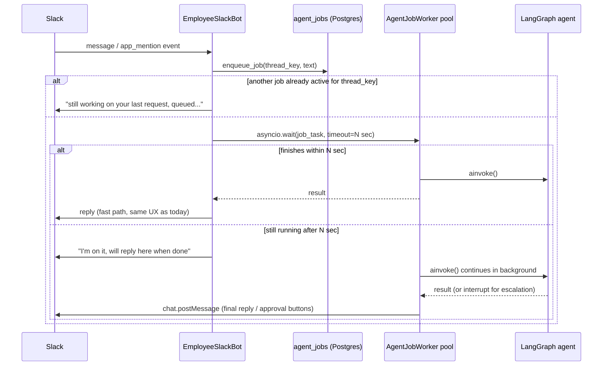

# Async Agents, Concurrency Control, and Human-in-the-Loop Escalation

> Add a Postgres-backed async job queue so employees can run multi-minute tasks without blocking Slack Socket Mode, serialize/cancel concurrent requests per conversation thread, add a LangGraph Postgres checkpointer for thread memory and pause/resume, and add an `escalate_to_human` tool with fire-and-forget and interactive-approval modes.

## Scope and decisions

Based on user answers:
- Job queue backend: **Postgres-backed job table + in-process asyncio worker pool** (no new infra service; reuses the existing `database_url`).
- HITL: **phased** — Phase A ships a fire-and-forget `escalate_to_human` tool with no checkpointer; Phase B adds a Postgres LangGraph checkpointer + interactive Slack Approve/Deny buttons that pause/resume the graph.
- Escalation policy: **backend/API only** for now (JSONB field + tool). No dashboard UI in this plan.
- Primary target is Slack ([apps/api/app/gateway/slack_bot.py](apps/api/app/gateway/slack_bot.py)), since that's what the write-up covers. Discord ([apps/api/app/gateway/discord_bot.py](apps/api/app/gateway/discord_bot.py)) shares the same `graph.ainvoke(...)` pattern and is called out as a fast-follow, not blocking this plan.

This single plan directly answers all 4 numbered questions:
1. Long-running (5-6 min) tasks → Phase 1-2 (async job queue + immediate ack).
2. Concurrent/overlapping messages → Phase 3 (per-thread serialization + cancel keyword).
3. Ask/wait for confirmation → Phase 4 (Postgres checkpointer + thread memory, generic `interrupt()` support).
4. Escalate to human (DM vs channel) → Phase 5 (fire-and-forget) and Phase 6 (interactive approval, built on Phase 4).

## Current state (from codebase audit)

- Agent graph compiled with **no checkpointer**: `return workflow.compile()` in [apps/api/app/agent/build.py](apps/api/app/agent/build.py) line 82.
- Tool loop capped at 5 rounds via `route_after_llm` in the same file (lines 23-36).
- [apps/api/app/gateway/slack_bot.py](apps/api/app/gateway/slack_bot.py) `_process_slack_message` runs `await self._run_agent(text)` synchronously inside the Socket Mode event handler, then `say(...)` once (lines 158-168, 205-235). `EmployeeDiscordBot._run_agent` in [apps/api/app/gateway/discord_bot.py](apps/api/app/gateway/discord_bot.py) follows the identical pattern.
- No task table, no locks, no cancellation — every inbound event spawns a brand-new stateless invocation.
- `Employee` model ([apps/api/app/employees/models.py](apps/api/app/employees/models.py)) has no escalation fields; `memory_policy` JSONB exists as a precedent for adding a similar `escalation_policy` JSONB column.
- `BotGatewayManager` ([apps/api/app/gateway/manager.py](apps/api/app/gateway/manager.py)) already runs a 60s background `asyncio` refresh loop and uses `asyncio.wait([task], timeout=...)` for bounded waits — this plan reuses that exact idiom for the "wait briefly, then ack" pattern.
- Each `EmployeeSlackBot` already owns a full `slack_bolt.async_app.AsyncApp` connected via Socket Mode — Slack **interactive components (buttons)** are delivered over the same Socket Mode connection via `app.action(...)`, so Phase 6 needs **no new public webhook / signing-secret verification**.

## Architecture diagram



## Phase 0 — Dependencies and config

- [apps/api/pyproject.toml](apps/api/pyproject.toml): bump `langgraph` to a version with stable `interrupt`/`Command` support, add `langgraph-checkpoint-postgres` and its `psycopg[binary,pool]` dependency.
- [apps/api/app/core/config.py](apps/api/app/core/config.py): add
  - `agent_job_sync_wait_seconds: float = 3.0` (grace period before falling back to async ack)
  - `agent_worker_concurrency: int = 4`
  - `agent_job_poll_interval_seconds: float = 1.0`
  - `checkpoint_database_url: str = ""` (psycopg-style DSN for `AsyncPostgresSaver`; falls back to deriving from `database_url` if empty)

## Phase 1 — Postgres-backed job queue (answers Q1)

New package `apps/api/app/agent/jobs/`:
- `models.py` — `AgentJob` SQLAlchemy model: `id`, `employee_id` (FK), `platform`, `channel_id`, `thread_key` (stable conversation id, e.g. `f"{platform}:{employee_id}:{channel_id}:{root_ts}"`), `user_text`, `status` (`pending`/`running`/`awaiting_approval`/`succeeded`/`failed`/`cancelled`), `result_text`, `error`, `created_at`, `started_at`, `finished_at`.
- `queue.py`:
  - `enqueue_job(db, ...) -> AgentJob`
  - `claim_next_job(db) -> AgentJob | None` — `SELECT ... WHERE status='pending' AND thread_key NOT IN (SELECT thread_key FROM agent_jobs WHERE status IN ('running','awaiting_approval')) ORDER BY created_at FOR UPDATE SKIP LOCKED LIMIT 1` (this single query implements both dequeue and Phase 3's per-thread serialization).
  - `get_active_job_for_thread(db, thread_key) -> AgentJob | None`
- `runner.py` — `run_job(job)`: shared logic extracted from `EmployeeSlackBot._run_agent` / `EmployeeDiscordBot._run_agent` (calls `get_graph_for_employee`, builds `initial_state`/`config`, invokes graph, updates job row, sends the reply via the right platform client).
- `worker.py` — `AgentJobWorker`: `agent_worker_concurrency` asyncio loops polling `claim_next_job` every `agent_job_poll_interval_seconds`, each running `run_job` and tracking `running_tasks: dict[job_id, asyncio.Task]` for cancellation (Phase 3).

Alembic migration: new `agent_jobs` table (indexes on `thread_key`, `status`).

[apps/api/app/gateway/manager.py](apps/api/app/gateway/manager.py): start/stop the `AgentJobWorker` pool in `BotGatewayManager.start()`/`stop()`, alongside the existing refresh loop.

## Phase 2 — Wire Slack to the queue with immediate ack (answers Q1)

Rework `EmployeeSlackBot._process_slack_message` / `_run_agent` in [apps/api/app/gateway/slack_bot.py](apps/api/app/gateway/slack_bot.py):

```python
job = await enqueue_job(db, employee_id=..., platform="slack",
                         channel_id=channel, thread_key=thread_key, user_text=text)
task = asyncio.create_task(run_job_and_track(job.id))
done, _ = await asyncio.wait([task], timeout=settings.agent_job_sync_wait_seconds)
if done:
    await say(text=task.result(), channel=channel, thread_ts=thread_ts)
else:
    await say(text="I'm on it! I'll reply here when it's done.",
               channel=channel, thread_ts=thread_ts)
    # task keeps running in the worker; final reply sent by runner.py via WebClient
```

This preserves today's UX for quick replies (< ~3s) and only shows the "I'm on it" message for genuinely long tasks — directly resolving the blocking/Socket-Mode-timeout problem without touching short-task behavior.

`runner.py`'s Slack reply path uses `slack_sdk.web.async_client.AsyncWebClient(token=bot_token).chat_postMessage(channel=..., thread_ts=...)` (decrypting the token the same way `manager.py` already does via `decrypt_slack_token`), since the worker runs outside the original event handler's `say()` closure.

## Phase 3 — Concurrency control and cancellation (answers Q2)

- Serialization is already enforced by `claim_next_job`'s `thread_key NOT IN (running/awaiting_approval)` clause: multiple messages in the same thread queue up FIFO; different threads/DMs still run fully in parallel.
- In `_process_slack_message`, before enqueuing, check `get_active_job_for_thread`; if one exists, skip the sync-wait and immediately reply: *"I'm still working on your last request in this thread — I'll start this one right after. Reply `cancel` to stop the current task instead."*
- Add a lightweight cancel path: if `text.strip().lower() in {"cancel", "stop"}`, look up the active job for the thread, mark it `cancelled` in `agent_jobs`, and call `.cancel()` on its tracked `asyncio.Task` in `AgentJobWorker.running_tasks`; reply confirming cancellation. (Keyword-based, not NLU intent detection — documented as a scoped v1, not full cancellation semantics.)

## Phase 4 — Postgres checkpointer and thread memory (answers Q3)

- New [apps/api/app/agent/checkpointer.py](apps/api/app/agent/checkpointer.py): module-level `AsyncPostgresSaver` created from `settings.checkpoint_database_url`, `.setup()` called once during FastAPI `lifespan` in [apps/api/app/main.py](apps/api/app/main.py), connection pool closed on shutdown.
- [apps/api/app/agent/build.py](apps/api/app/agent/build.py): `workflow.compile(checkpointer=get_checkpointer())` instead of `workflow.compile()`.
- `thread_key` (from Phase 1) is passed as `config["configurable"]["thread_id"]` on every `graph.ainvoke(...)` call (in `runner.py` and the `/api/agent/run` route). Because `AgentState` extends `MessagesState` (`add_messages` reducer), only the new `HumanMessage` needs to be passed per turn — LangGraph automatically merges it with the checkpointed history. This removes the need to separately fetch Slack `conversations.replies` for context and fixes the "no thread history" gap as a side effect.
- No graph topology changes required for basic pause/resume — `interrupt()` (from `langgraph.types`) can be called from any node/tool once a checkpointer is present; `CustomToolNode` in [apps/api/app/agent/nodes/tool_executor.py](apps/api/app/agent/nodes/tool_executor.py) is a thin subclass of the prebuilt `ToolNode` and does not swallow exceptions, so `GraphInterrupt` propagates correctly.

## Phase 5 — `escalate_to_human` tool, fire-and-forget mode (answers Q4-A/B/C-1)

- [apps/api/app/employees/models.py](apps/api/app/employees/models.py): add `escalation_policy: Mapped[dict | None] = mapped_column(JSONB, nullable=True)`, matching the shape in the write-up (`manager_slack_id`, `default_escalation_channel`, `sensitive_rules`). Alembic migration for the new column.
- [apps/api/app/employees/schemas.py](apps/api/app/employees/schemas.py): add `escalation_policy: dict | None = None` to `CreateEmployeeRequest`, `UpdateEmployeeRequest`, `EmployeeResponse` (API-settable now; dashboard UI is an explicit follow-up).
- New [apps/api/app/agent/tools/escalation.py](apps/api/app/agent/tools/escalation.py):
  ```python
  @tool
  async def escalate_to_human(reason: str, is_sensitive: bool = False,
                               config: RunnableConfig = None) -> str:
      """Escalate a query to a human manager when policy is exceeded or info is missing."""
      # 1. load employee + escalation_policy via config["configurable"]["employee_id"]/["db"]
      # 2. resolve target: manager DM if is_sensitive, else default_escalation_channel
      # 3. decrypt this employee's slack bot token, AsyncWebClient(...).chat_postMessage(...)
      # 4. return "Escalated to human supervisor." to the agent
  ```
- Wire the tool into `BUILT_IN_TOOLS` ([apps/api/app/agent/tools/executor.py](apps/api/app/agent/tools/executor.py)) and add `"escalate_to_human"` to `allowed_tools` on `HR_TEMPLATE` / `SUPPORT_TEMPLATE` / `SALES_TEMPLATE` in [apps/api/app/employees/templates.py](apps/api/app/employees/templates.py).
- Agent behavior for this mode is prompt-driven: after the tool returns its confirmation string, the agent tells the user "I've escalated this to my manager via DM/#channel; they'll get back to you." Run completes normally — no checkpointer dependency.

## Phase 6 — Interactive approval mode (answers Q4-C-2, builds on Phase 4)

- Extend `escalate_to_human` (or add `escalate_to_human_interactive`, gated by an `escalation_policy` flag e.g. `"mode": "interactive"`) to post a Block Kit message with **Approve**/**Deny** buttons whose `value` encodes the `thread_key`, then call `interrupt({"reason": reason, "thread_key": thread_key})`. The `run_job` call in `runner.py` marks the job `awaiting_approval` when `ainvoke` returns an `__interrupt__` result instead of a final answer, and skips sending a "done" reply (the ack "I've escalated this..." message was already sent as part of Phase 2/5's fast path, or a dedicated "waiting for manager approval" message is sent here).
- [apps/api/app/gateway/slack_bot.py](apps/api/app/gateway/slack_bot.py): register `self.app.action("escalation_decision")(self.handle_escalation_decision)` in `EmployeeSlackBot.__init__` alongside the existing `event(...)` registrations — this arrives over the **same Socket Mode connection**, no new HTTP route or signing-secret verification needed.
- `handle_escalation_decision`: parse `thread_key` + `approve`/`deny` from the button payload, look up the `awaiting_approval` job by `thread_key`, resume the graph with `graph.ainvoke(Command(resume={"decision": decision, "by": body["user"]["id"]}), config={"configurable": {"thread_id": thread_key, ...}})`, mark the job `succeeded`, `chat_update` the manager's message to show the decision, and `chat_postMessage` the final agent response back into the original user's thread.

## Files touched (summary)

- New: `apps/api/app/agent/jobs/{models,queue,runner,worker}.py`, `apps/api/app/agent/checkpointer.py`, `apps/api/app/agent/tools/escalation.py`, 2 Alembic migrations.
- Changed: [build.py](apps/api/app/agent/build.py), [slack_bot.py](apps/api/app/gateway/slack_bot.py), [manager.py](apps/api/app/gateway/manager.py), [config.py](apps/api/app/core/config.py), [main.py](apps/api/app/main.py), [employees/models.py](apps/api/app/employees/models.py), [employees/schemas.py](apps/api/app/employees/schemas.py), [templates.py](apps/api/app/employees/templates.py), [executor.py](apps/api/app/agent/tools/executor.py), [pyproject.toml](apps/api/pyproject.toml).
- Follow-up (not in this plan): apply the same job-queue/checkpointer wiring to [discord_bot.py](apps/api/app/gateway/discord_bot.py); dashboard UI for escalation policy settings.

## Verification

- Unit tests for `queue.py` (serialization: two enqueues on same `thread_key` → only one claimable at a time).
- Unit test simulating a slow tool (`asyncio.sleep`) to prove the sync-wait/ack fallback fires at the right threshold.
- Unit test for cancel keyword flow.
- Integration-style test with a fake checkpointer verifying `thread_id` reuse restores prior messages.
- Manual Slack test in a dev workspace: long task → ack then final reply; second message mid-task → queued/cancel behavior; escalation fire-and-forget → manager DM; escalation interactive → Approve button resumes and replies in original thread.
- `uv run ruff check`, `uv run python -m compileall app alembic`, `uv run alembic upgrade head --sql` for both new migrations.

## Implementation todos

- [ ] Phase 0: add langgraph-checkpoint-postgres/psycopg deps and new config settings
- [ ] Phase 1: build agent_jobs table, queue.py, runner.py, worker.py + migration
- [ ] Phase 2: wire EmployeeSlackBot to enqueue + sync-wait/ack pattern
- [ ] Phase 3: per-thread serialization + cancel keyword handling
- [ ] Phase 4: add Postgres checkpointer to build_graph and thread_id wiring
- [ ] Phase 5: escalation_policy field + escalate_to_human tool (fire-and-forget)
- [ ] Phase 6: interactive Approve/Deny buttons + interrupt/resume flow
- [ ] Run ruff/compileall/alembic checks and manual Slack test pass
