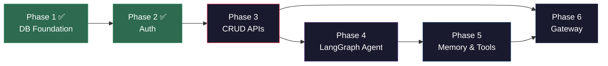

# OpenHuman AI Engine — Phased Implementation Plan (Revised)

> Build the complete Python AI engine following [BigPicture.md](file:///mnt/work/PROJECTS/openhuman/docs/BigPicture.md) and [Backend.md](file:///mnt/work/PROJECTS/openhuman/docs/Backend.md).

## ✅ Tech Decisions Locked In

| Concern | Decision |
|---------|----------|
| **LLM Client** | `langchain-openrouter` — `ChatOpenRouter` model |
| **Agent Framework** | LangGraph `StateGraph` + LangChain message types (`HumanMessage`, `AIMessage`, `ToolMessage`) |
| **Tools** | LangChain `@tool` decorator + `ToolNode`. **4 built-in tools**: `search_web`, `get_datetime`, `calculate`, `fetch_url`. No MCP for now. |
| **Memory** | **Mock stub for now** — `memory_search` returns `[]`, `memory_ingest` returns `True`. Cognee deferred. |

---

## Current State Audit (Post Pull)

### ✅ Done — Phase 1: Database Foundation
All ORM models, async engine, Alembic migration, config.

| File | Status |
|------|--------|
| [config.py](file:///mnt/work/PROJECTS/openhuman/apps/api/app/core/config.py) | ✅ DB, JWT, encryption, Cognee settings |
| [database.py](file:///mnt/work/PROJECTS/openhuman/apps/api/app/core/database.py) | ✅ AsyncEngine, session factory, Base, get_db |
| [auth/models.py](file:///mnt/work/PROJECTS/openhuman/apps/api/app/auth/models.py) | ✅ User ORM (UUID PK, email, password_hash) |
| [organizations/models.py](file:///mnt/work/PROJECTS/openhuman/apps/api/app/organizations/models.py) | ✅ Organization ORM (6 Cognee columns) |
| [employees/models.py](file:///mnt/work/PROJECTS/openhuman/apps/api/app/employees/models.py) | ✅ Employee ORM (JSONB fields, encrypted tokens, Cognee IDs) |
| [channel_assignments/models.py](file:///mnt/work/PROJECTS/openhuman/apps/api/app/channel_assignments/models.py) | ✅ ChannelAssignment ORM |
| [documents/models.py](file:///mnt/work/PROJECTS/openhuman/apps/api/app/documents/models.py) | ✅ Document ORM |
| [alembic migration](file:///mnt/work/PROJECTS/openhuman/apps/api/alembic/versions/3b3f34b263c7_initial_schema.py) | ✅ 5 tables, FK order |
| [pyproject.toml](file:///mnt/work/PROJECTS/openhuman/apps/api/pyproject.toml) | ✅ asyncpg, bcrypt, jose, cryptography |

### ✅ Done — Phase 2: Auth
JWT auth, password hashing, token encryption, auth dependency.

| File | Status |
|------|--------|
| [security.py](file:///mnt/work/PROJECTS/openhuman/apps/api/app/core/security.py) | ✅ bcrypt, JWT HS256, AES-256-GCM |
| [dependencies.py](file:///mnt/work/PROJECTS/openhuman/apps/api/app/core/dependencies.py) | ✅ get_current_user (Bearer JWT) |
| [auth/schemas.py](file:///mnt/work/PROJECTS/openhuman/apps/api/app/auth/schemas.py) | ✅ Register, Login, Token, UserResponse |
| [auth/service.py](file:///mnt/work/PROJECTS/openhuman/apps/api/app/auth/service.py) | ✅ register, authenticate, make_token |
| [auth/router.py](file:///mnt/work/PROJECTS/openhuman/apps/api/app/auth/router.py) | ✅ /register, /login, /me |
| [main.py](file:///mnt/work/PROJECTS/openhuman/apps/api/app/main.py) | ✅ Auth router wired, model imports |

### ❌ Empty — Still to Build (28 non-`__init__` files)

```
CRUD Layer (10 files):
  organizations/ → schemas.py, service.py, router.py
  employees/     → schemas.py, service.py, router.py
  channel_assignments/ → schemas.py, router.py
  documents/     → schemas.py, service.py, router.py

Agent Engine (15 files):
  agent/ → state.py, schemas.py, build.py, router.py
  agent/nodes/ → input_guardrail.py, build_prompt.py, llm_call.py,
                 tool_executor.py, output_guardrail.py, formatter.py
  agent/guardrails/ → input.py, output.py
  agent/tools/ → executor.py, mcp_client.py

Memory (3 files):
  memory/ → schemas.py, service.py, router.py

Gateway (3 files):
  gateway/ → manager.py, discord_bot.py, slack_bot.py
```

---

## Open Questions

> [!IMPORTANT]
> 1. **OpenRouter credentials** — Ensure `OPENROUTER_API_KEY` is in your `.env` before Phase 4 testing.
> 2. **Bot tokens** — Have Discord/Slack tokens for Phase 6 gateway testing, or stub the gateway?
> 3. **MCP servers** — Stub the MCP client for now?

---

## Phase 3: Organizations + Employees + Documents CRUD

**Goal**: Full REST API for orgs, employees, channel assignments, and documents. Authorization enforced (users only see their own orgs).

### Organizations Module

#### [MODIFY] [organizations/schemas.py](file:///mnt/work/PROJECTS/openhuman/apps/api/app/organizations/schemas.py)
- `CreateOrganizationRequest(name: str)`
- `UpdateOrganizationRequest(name: str | None)`
- `OrganizationResponse(id, name, owner_id, cognee_tenant_id, cognee_dataset_name, employee_count, created_at)` — `from_attributes=True`

#### [MODIFY] [organizations/service.py](file:///mnt/work/PROJECTS/openhuman/apps/api/app/organizations/service.py)
- `create_org(db, user_id, data) → Organization`
- `get_org(db, org_id, user_id) → Organization | None` (ownership check)
- `list_orgs(db, user_id) → list[Organization]`
- `update_org(db, org_id, user_id, data) → Organization`
- `delete_org(db, org_id, user_id) → bool`

#### [MODIFY] [organizations/router.py](file:///mnt/work/PROJECTS/openhuman/apps/api/app/organizations/router.py)

| Method | Path | Auth |
|--------|------|------|
| POST | `/api/organizations` | ✅ |
| GET | `/api/organizations` | ✅ |
| GET | `/api/organizations/{org_id}` | ✅ |
| PATCH | `/api/organizations/{org_id}` | ✅ |
| DELETE | `/api/organizations/{org_id}` | ✅ |

---

### Employees Module

#### [MODIFY] [employees/schemas.py](file:///mnt/work/PROJECTS/openhuman/apps/api/app/employees/schemas.py)
- `CreateEmployeeRequest(name, role?, personality?, specialization?, duties?, memory_policy?)`
- `UpdateEmployeeRequest(name?, role?, personality?, specialization?, duties?, memory_policy?, status?)`
- `EmployeeResponse(id, org_id, name, role, personality, specialization, duties, memory_policy, mcp_connections, status, cognee_user_id, cognee_dataset_name, channel_assignments, created_at)`
- `DiscordTokenRequest(token: str)`, `StatusRequest(status: str)`

#### [MODIFY] [employees/service.py](file:///mnt/work/PROJECTS/openhuman/apps/api/app/employees/service.py)
- Full CRUD + `store_discord_token()` (encrypts via AES-256-GCM) + `update_status()`
- Ownership checks: employee → org → user chain

#### [MODIFY] [employees/router.py](file:///mnt/work/PROJECTS/openhuman/apps/api/app/employees/router.py)

| Method | Path | Auth |
|--------|------|------|
| POST | `/api/organizations/{org_id}/employees` | ✅ |
| GET | `/api/organizations/{org_id}/employees` | ✅ |
| GET | `/api/organizations/{org_id}/employees/{emp_id}` | ✅ |
| PATCH | `/api/organizations/{org_id}/employees/{emp_id}` | ✅ |
| DELETE | `/api/organizations/{org_id}/employees/{emp_id}` | ✅ |
| PUT | `/api/organizations/{org_id}/employees/{emp_id}/discord` | ✅ |
| PUT | `/api/organizations/{org_id}/employees/{emp_id}/status` | ✅ |

---

### Channel Assignments (sub-route)

#### [MODIFY] [channel_assignments/schemas.py](file:///mnt/work/PROJECTS/openhuman/apps/api/app/channel_assignments/schemas.py)
- `CreateChannelAssignmentRequest(platform, channel_id, channel_name?)`
- `ChannelAssignmentResponse(id, platform, channel_id, channel_name)`

#### [MODIFY] [channel_assignments/router.py](file:///mnt/work/PROJECTS/openhuman/apps/api/app/channel_assignments/router.py)
- `POST/DELETE` under `/api/organizations/{org_id}/employees/{emp_id}/channel-assignments`

---

### Documents Module

#### [MODIFY] [documents/schemas.py](file:///mnt/work/PROJECTS/openhuman/apps/api/app/documents/schemas.py)
- `DocumentResponse(id, filename, content_type, size_bytes, status, uploaded_at)`

#### [MODIFY] [documents/service.py](file:///mnt/work/PROJECTS/openhuman/apps/api/app/documents/service.py)
- File metadata storage (no Cognee yet — that's Phase 5)

#### [MODIFY] [documents/router.py](file:///mnt/work/PROJECTS/openhuman/apps/api/app/documents/router.py)
- `POST /api/documents/upload`, `GET /api/documents`, `DELETE /api/documents/{doc_id}`

---

### [NEW] [employees/templates.py](file:///mnt/work/PROJECTS/openhuman/apps/api/app/employees/templates.py)
`EmployeeTemplate` Pydantic model + built-in templates: `HR_TEMPLATE`, `SALES_TEMPLATE`, `SUPPORT_TEMPLATE` per spec.

### Wire Routers in [main.py](file:///mnt/work/PROJECTS/openhuman/apps/api/app/main.py)
Register org, employee, channel-assignment, and document routers.

### Verify
```bash
# Create org → Create employee → Store Discord token → Activate
# All CRUD endpoints return correct responses
# OpenAPI spec exports cleanly
uv run python scripts/export_openapi.py
```

---

## Phase 4: LangGraph Agent Core

**Goal**: The beating heart — state, 6 nodes, graph builder, LLM provider. Testable via `POST /api/agent/run`.

### Dependencies

#### [MODIFY] [pyproject.toml](file:///mnt/work/PROJECTS/openhuman/apps/api/pyproject.toml)
Add:
- `langgraph>=0.2.0` — graph engine
- `langchain>=0.2.0` — message types, `@tool`, `ToolNode`
- `langchain-openrouter` — `ChatOpenRouter` LLM class

---

### Agent State & Schemas

#### [MODIFY] [agent/state.py](file:///mnt/work/PROJECTS/openhuman/apps/api/app/agent/state.py)
Use **LangGraph's `MessagesState`** as base — it provides the `messages` list with built-in `add_messages` reducer.

```python
from langgraph.graph import MessagesState

class AgentState(MessagesState):
    # Everything in MessagesState.messages is already handled
    employee_id: str           # PG UUID for tool context
    platform: str              # "discord" | "slack" | "api"
    input_blocked: bool
    block_reason: str | None
    system_prompt: str
    tool_round: int
    response: str | None
    output_guardrail_passed: bool
    error: str | None
```

#### [MODIFY] [agent/schemas.py](file:///mnt/work/PROJECTS/openhuman/apps/api/app/agent/schemas.py)
- `MessageInput(content, platform, channel_id, user_id, employee_id, employee_name?, org_name?, system_prompt_template?)`
- `AgentResponse(response, tool_calls_count, error?)`

---

### LLM Provider

#### [NEW] [agent/llm/__init__.py](file:///mnt/work/PROJECTS/openhuman/apps/api/app/agent/llm/__init__.py)
#### [NEW] [agent/llm/provider.py](file:///mnt/work/PROJECTS/openhuman/apps/api/app/agent/llm/provider.py)

```python
from langchain_openrouter import ChatOpenRouter
from app.core.config import settings

def get_llm(tools=None):
    """Return a ChatOpenRouter instance, optionally bound to tools."""
    llm = ChatOpenRouter(
        model=settings.openrouter_model,         # e.g. "openai/gpt-4o-mini"
        api_key=settings.openrouter_api_key,
    )
    if tools:
        return llm.bind_tools(tools)             # LangChain native tool binding
    return llm
```

> [!NOTE]
> Add `openrouter_api_key` and `openrouter_model` to `config.py`.

---

### Graph Nodes (6 files)

All nodes are plain `async def node(state: AgentState) -> dict` functions — LangGraph merges the returned dict into state.

#### [MODIFY] [nodes/input_guardrail.py](file:///mnt/work/PROJECTS/openhuman/apps/api/app/agent/nodes/input_guardrail.py)
- Calls `guardrails/input.py` → checks message length, injection patterns
- Returns `{"input_blocked": True, "block_reason": "..."}` if rejected

#### [MODIFY] [nodes/build_prompt.py](file:///mnt/work/PROJECTS/openhuman/apps/api/app/agent/nodes/build_prompt.py)
- Assembles `system_prompt` from employee config (name, role, personality, duties, org_name)
- Returns `{"system_prompt": ..., "tool_round": 0, "messages": [SystemMessage(system_prompt), HumanMessage(input.content)]}`
- Uses **LangChain message types**: `SystemMessage`, `HumanMessage`

#### [MODIFY] [nodes/llm_call.py](file:///mnt/work/PROJECTS/openhuman/apps/api/app/agent/nodes/llm_call.py)
- Calls `get_llm(tools=state["tools"]).ainvoke(state["messages"])`
- LangChain `AIMessage` with `tool_calls` appended to messages automatically

#### [MODIFY] [nodes/tool_executor.py](file:///mnt/work/PROJECTS/openhuman/apps/api/app/agent/nodes/tool_executor.py)
- Use **LangGraph `ToolNode`** for standard tool dispatch
- Injects `employee_id` into tool calls via state context
- Increments `tool_round`

#### [MODIFY] [nodes/output_guardrail.py](file:///mnt/work/PROJECTS/openhuman/apps/api/app/agent/nodes/output_guardrail.py)
- Extracts final text from last `AIMessage`
- Runs `guardrails/output.py` checks
- Returns `{"output_guardrail_passed": True, "response": ...}`

#### [MODIFY] [nodes/formatter.py](file:///mnt/work/PROJECTS/openhuman/apps/api/app/agent/nodes/formatter.py)
- Platform-specific truncation (Discord: 2000 chars, Slack: 4000 chars)
- Sets final `response`

---

### Guardrail Logic

#### [MODIFY] [guardrails/input.py](file:///mnt/work/PROJECTS/openhuman/apps/api/app/agent/guardrails/input.py)
- `check_input(content, guardrail_config) → (blocked: bool, reason: str | None)`
- Length limit, injection pattern detection, PII regex

#### [MODIFY] [guardrails/output.py](file:///mnt/work/PROJECTS/openhuman/apps/api/app/agent/guardrails/output.py)
- `check_output(response, guardrail_config) → (passed: bool, reason: str | None)`
- Blocked phrase filter, citation threshold check

---

### Graph Builder

#### [MODIFY] [agent/build.py](file:///mnt/work/PROJECTS/openhuman/apps/api/app/agent/build.py)

```python
from langgraph.graph import StateGraph, START, END
from langgraph.prebuilt import ToolNode

def build_graph(tools: list) -> CompiledGraph:
    graph = StateGraph(AgentState)
    graph.add_node("input_guardrail", input_guardrail_node)
    graph.add_node("build_prompt", build_prompt_node)
    graph.add_node("llm_call", llm_call_node)
    graph.add_node("tools", ToolNode(tools))   # LangGraph built-in ToolNode
    graph.add_node("output_guardrail", output_guardrail_node)
    graph.add_node("formatter", formatter_node)

    graph.add_edge(START, "input_guardrail")
    graph.add_conditional_edges("input_guardrail", route_after_guardrail)
    graph.add_edge("build_prompt", "llm_call")
    graph.add_conditional_edges("llm_call", route_after_llm)  # tool_calls → tools, else → output_guardrail
    graph.add_edge("tools", "llm_call")           # THE CYCLE
    graph.add_edge("output_guardrail", "formatter")
    graph.add_edge("formatter", END)
    return graph.compile()
```

---

### Agent Router (test endpoint)

#### [MODIFY] [agent/router.py](file:///mnt/work/PROJECTS/openhuman/apps/api/app/agent/router.py)
- `POST /api/agent/run` — accepts `MessageInput`, builds graph, invokes, returns `AgentResponse`
- For testing only; bots call `graph.ainvoke()` directly

---

### Verify
```bash
# Simple greeting — 0 tool calls
curl -X POST localhost:8000/api/agent/run \
  -d '{"content":"hey","platform":"api","employee_id":"..."}'
# → {"response":"Hey! How can I help?","tool_calls_count":0}

# Memory query — 1 tool call (mock returns empty)
curl -X POST localhost:8000/api/agent/run \
  -d '{"content":"what did we decide about the API?","platform":"api","employee_id":"..."}'
# → {"response":"I don't have that info yet...","tool_calls_count":1}
```

---

## Phase 5: Memory & Tools

**Goal**: LangChain `@tool` definitions, mock memory service, MCP client stub.

### Memory Service (Mock — Cognee deferred)

#### [MODIFY] [memory/service.py](file:///mnt/work/PROJECTS/openhuman/apps/api/app/memory/service.py)

```python
from dataclasses import dataclass

@dataclass
class MemoryResult:
    text: str
    dataset_name: str
    source: str
    score: float | None

async def memory_search(query: str, employee_id: str) -> list[MemoryResult]:
    """Mock: returns empty. Replace with Cognee when ready."""
    return []

async def memory_ingest(content: str, employee_id: str) -> bool:
    """Mock: always succeeds. Replace with Cognee when ready."""
    return True
```

#### [MODIFY] [memory/schemas.py](file:///mnt/work/PROJECTS/openhuman/apps/api/app/memory/schemas.py)
- `MemorySearchRequest(query, employee_id)`, `MemorySearchResponse(results, query)`
- `MemoryIngestRequest(content, employee_id)`, `MemoryIngestResponse(status)`

#### [MODIFY] [memory/router.py](file:///mnt/work/PROJECTS/openhuman/apps/api/app/memory/router.py)
- `POST /api/memory/search`, `POST /api/memory/ingest`

---

### LangChain Tools

#### [MODIFY] [agent/tools/executor.py](file:///mnt/work/PROJECTS/openhuman/apps/api/app/agent/tools/executor.py)
Define built-in tools using **LangChain `@tool` decorator** — these plug directly into `ToolNode`:

```python
from langchain_core.tools import tool
from app.memory.service import memory_search, memory_ingest

@tool
async def search_memory(query: str) -> str:
    """Search team memory for facts, decisions, and knowledge."""
    results = await memory_search(query, employee_id=_get_context_employee_id())
    if not results:
        return "No relevant memory found."
    return "\n".join(r.text for r in results)

@tool
async def ingest_memory(content: str) -> str:
    """Store an important fact or decision in team memory."""
    await memory_ingest(content, employee_id=_get_context_employee_id())
    return "Remembered."

# employee_id injected via contextvars (set by agent runner before invoke)
BUILT_IN_TOOLS = [search_memory, ingest_memory]
```

---

### Built-in Tools

#### [MODIFY] [agent/tools/executor.py](file:///mnt/work/PROJECTS/openhuman/apps/api/app/agent/tools/executor.py)
4 real tools using LangChain `@tool`. **New dep**: `duckduckgo-search` (free, no API key).

```python
from langchain_core.tools import tool
from duckduckgo_search import DDGS
from datetime import datetime
import ast, operator, httpx

@tool
async def search_web(query: str) -> str:
    """Search the web for current information, news, or facts."""
    with DDGS() as ddgs:
        results = list(ddgs.text(query, max_results=5))
    if not results:
        return "No results found."
    return "\n\n".join(f"**{r['title']}**\n{r['body']}\nSource: {r['href']}" for r in results)

@tool
def get_datetime(timezone: str = "UTC") -> str:
    """Get the current date and time. Useful for scheduling and time-sensitive tasks."""
    return datetime.now().strftime(f"Current datetime: %Y-%m-%d %H:%M:%S ({timezone})")

@tool
def calculate(expression: str) -> str:
    """Safely evaluate a mathematical expression. E.g. '2 + 2 * 10 / 5'."""
    # Safe AST-based eval — no exec, no builtins
    _OPS = {ast.Add: operator.add, ast.Sub: operator.sub,
            ast.Mult: operator.mul, ast.Div: operator.truediv, ast.Pow: operator.pow}
    def _eval(node):
        if isinstance(node, ast.Constant): return node.value
        if isinstance(node, ast.BinOp): return _OPS[type(node.op)](_eval(node.left), _eval(node.right))
        if isinstance(node, ast.UnaryOp) and isinstance(node.op, ast.USub): return -_eval(node.operand)
        raise ValueError(f"Unsupported: {node}")
    try:
        return str(_eval(ast.parse(expression, mode='eval').body))
    except Exception as e:
        return f"Error: {e}"

@tool
async def fetch_url(url: str) -> str:
    """Fetch and return the text content of a webpage or public URL."""
    async with httpx.AsyncClient(follow_redirects=True, timeout=10) as client:
        resp = await client.get(url)
        resp.raise_for_status()
        # Basic HTML strip — return first 3000 chars
        import re
        text = re.sub(r'<[^>]+>', ' ', resp.text)
        text = re.sub(r'\s+', ' ', text).strip()
        return text[:3000]

# Memory tools (mock — swap with Cognee later)
@tool
async def search_memory(query: str) -> str:
    """Search team memory for past decisions, facts, and knowledge."""
    return "No relevant memory found."  # mock

@tool
async def ingest_memory(content: str) -> str:
    """Store an important fact or decision in team memory for future reference."""
    return "Remembered."  # mock

BUILT_IN_TOOLS = [search_web, get_datetime, calculate, fetch_url, search_memory, ingest_memory]
```

#### [DELETE] [agent/tools/mcp_client.py](file:///mnt/work/PROJECTS/openhuman/apps/api/app/agent/tools/mcp_client.py)
Leave as empty `__init__`-style stub — no MCP logic needed yet.

---

### Verify
```bash
# Test web search
curl -X POST localhost:8000/api/agent/run \
  -d '{"content":"what is the latest news about AI?","platform":"api","employee_id":"..."}'
# → agent calls search_web → returns summarized news

# Test calculator
curl -X POST localhost:8000/api/agent/run \
  -d '{"content":"what is 15% of 8500?","platform":"api","employee_id":"..."}'
# → agent calls calculate("8500 * 0.15") → "1275.0"

# Test datetime
curl -X POST localhost:8000/api/agent/run \
  -d '{"content":"what day is it today?","platform":"api","employee_id":"..."}'
# → agent calls get_datetime() → responds with today’s date
```

---

## Phase 6: Bot Gateway + Integration

**Goal**: Discord/Slack bots, gateway manager, wire everything together, Dockerfile.

### Dependencies

#### [MODIFY] [pyproject.toml](file:///mnt/work/PROJECTS/openhuman/apps/api/pyproject.toml)
Add: `discord.py>=2.0`, `slack-bolt[async]>=1.0`

> [!NOTE]
> Bot gateway calls `graph.ainvoke()` directly — zero HTTP overhead. The compiled graph is initialized once at startup and reused per message.

---

### Gateway Implementation

#### [MODIFY] [gateway/discord_bot.py](file:///mnt/work/PROJECTS/openhuman/apps/api/app/gateway/discord_bot.py)
- `EmployeeDiscordBot(discord.Client)` — wraps one employee
- `on_message()` → checks @mention → builds `MessageInput` → `graph.ainvoke()` → sends response
- Handles message chunking (>2000 chars)

#### [MODIFY] [gateway/slack_bot.py](file:///mnt/work/PROJECTS/openhuman/apps/api/app/gateway/slack_bot.py)
- `EmployeeSlackBot` — wraps `slack-bolt` async app
- `app_mention` event → builds `MessageInput` → `graph.ainvoke()` → posts response in thread

#### [MODIFY] [gateway/manager.py](file:///mnt/work/PROJECTS/openhuman/apps/api/app/gateway/manager.py)
- `BotGatewayManager` — 60s refresh loop
- Queries DB for active employees with tokens (decrypts via `decrypt_token()`)
- `start_discord_bot()` / `stop_discord_bot()`
- `start_slack_bot()` / `stop_slack_bot()`
- Tracks active bots, handles reconnects

---

### Wire into Lifespan

#### [MODIFY] [main.py](file:///mnt/work/PROJECTS/openhuman/apps/api/app/main.py)
- Start `BotGatewayManager` as background task in `lifespan()` startup
- Cancel on shutdown
- Register ALL remaining routers: org, employee, channel-assignment, documents, memory, agent

---

### [NEW] [Dockerfile](file:///mnt/work/PROJECTS/openhuman/apps/api/Dockerfile)
Multi-stage: `python:3.12-slim` → `uv sync` → copy app → `uvicorn app.main:app`

---

### Verify
```bash
# 1. Register user → create org → create employee
# 2. Store Discord token → activate employee
# 3. Bot appears online within 60 seconds
# 4. @mention in Discord → agent responds
# 5. All API endpoints in OpenAPI spec
# 6. Docker build succeeds
```

---

## Dependency Graph



## Summary — Work Remaining

| Phase | Files to Write | New Deps | Effort |
|-------|---------------|----------|--------|
| **3** CRUD | 10 + 1 new (templates) | none | Medium |
| **4** Agent | 13 + 2 new (llm/) | `langgraph`, `langchain`, `langchain-openrouter` | Large |
| **5** Memory & Tools | 4 (mcp_client is stub) | `duckduckgo-search` | Small |
| **6** Gateway | 3 + Dockerfile | `discord.py`, `slack-bolt` | Medium |
