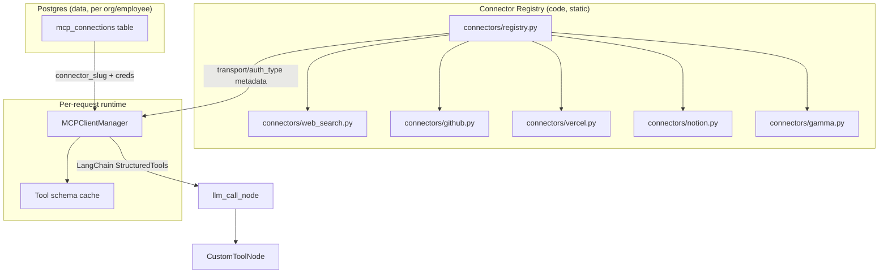

# MCP Integration Plan for OpenHuman API

> Build a generic, config-driven MCP (Model Context Protocol) integration layer in the FastAPI/LangGraph backend, then onboard Web Search, GitHub, Vercel, Notion, and Gamma as the first connectors — all through the same registry/plumbing so future MCPs are a config addition, not a code change. All connectors are chosen to be **free** (no paid API tiers, no paid subscriptions required).

## Current state (why this matters)

- Agent stack: Python **FastAPI + LangGraph + LangChain**. Graph is compiled **once** at startup with a static tool list (`agent_graph = build_graph(BUILT_IN_TOOLS)` in [apps/api/app/agent/router.py](file:///mnt/work/PROJECTS/openhuman/apps/api/app/agent/router.py)).
- Tools are LangChain `@tool` functions in [apps/api/app/agent/tools/executor.py](file:///mnt/work/PROJECTS/openhuman/apps/api/app/agent/tools/executor.py), filtered per-employee via `EmployeeTemplate.allowed_tools` in [apps/api/app/employees/templates.py](file:///mnt/work/PROJECTS/openhuman/apps/api/app/employees/templates.py) inside [apps/api/app/agent/nodes/llm_call.py](file:///mnt/work/PROJECTS/openhuman/apps/api/app/agent/nodes/llm_call.py).
- MCP is a **stub only**: [apps/api/app/agent/tools/mcp_client.py](file:///mnt/work/PROJECTS/openhuman/apps/api/app/agent/tools/mcp_client.py) has an `MCPClientManager` whose `connect()` always returns `[]`. It is never called from `build_prompt_node` or `llm_call_node`.
- `Employee.mcp_connections` (JSONB) exists in [apps/api/app/employees/models.py](file:///mnt/work/PROJECTS/openhuman/apps/api/app/employees/models.py) but has no write API and isn't used.
- Existing OAuth precedent: [apps/api/app/gateway/slack_oauth.py](file:///mnt/work/PROJECTS/openhuman/apps/api/app/gateway/slack_oauth.py) — signed-JWT state param, code exchange, `encrypt_token()`/`decrypt_token()` (AES-256-GCM, [apps/api/app/core/security.py](file:///mnt/work/PROJECTS/openhuman/apps/api/app/core/security.py)) to persist secrets. This pattern will be generalized for MCP OAuth.
- Confirmed (web research) how the requested MCP servers actually authenticate, and — per the requirement to **use free MCPs only** — which concrete server to pick for each:
  - **Web search** → **no paid API needed at all.** Use a free, key-less, open-source web-search MCP server (e.g. `RivalSearchMCP`, MIT-licensed, hosted Streamable HTTP endpoint with fair-use rate limiting and a self-host option, or `open-websearch` self-hosted via `npx`). Zero signup, zero cost, no API key to manage — better fit than Brave/Tavily/Exa, which require an account and a metered key.
  - **GitHub** (`https://api.githubcopilot.com/mcp/`) → **free via Personal Access Token (PAT).** Confirmed the remote server is available to every GitHub account regardless of plan; only OAuth sign-in nudges toward a Copilot seat, but PAT auth (`Authorization: Bearer <PAT>`) needs no paid license at all. Use PAT mode exclusively — skip OAuth for GitHub.
  - **Vercel** (`https://mcp.vercel.com`) → **OAuth 2.1 only**, but login is just against your existing Vercel account — the Hobby (free) plan works fine for reading projects/deployments/logs. No purchase required, just an OAuth consent screen.
  - **Notion** (`https://mcp.notion.com/mcp`) → **OAuth-only**, no bearer/PAT support at all. Works against a free Notion workspace; interactive user consent is required (can't be fully headless).
  - **Gamma** (`developers.gamma.app`) → hosted MCP is free on every plan including Gamma's free tier, but **custom (non-Claude/ChatGPT) integrations require Gamma's manual approval** (a request form with redirect URIs). This is a vendor-approval blocker, not a cost blocker — flag it as an external dependency with an owner/date, do it last.
  - Recommended Python glue library: **`langchain-mcp-adapters`** (`MultiServerMCPClient`), which wraps the official `mcp` SDK, supports `transport="streamable_http"` with a `headers` dict for static tokens (web search, GitHub PAT), or an `auth=` object (httpx.Auth / `OAuthClientProvider`) for full OAuth (Vercel, Notion, Gamma). No paid SDKs or hosting costs are introduced by this plan.

## Architecture: connector registry (the "easy to add more MCPs" part)

Each connector is one small declarative module (name, base URL, transport, `auth_type` enum: `none` / `api_key_header` / `pat_bearer` / `oauth2`, default scopes, docs link, default tool allow/deny). `MCPClientManager` and the OAuth router are written once against this metadata — adding connector #6 means adding one file to `connectors/`, not touching the manager, router, or graph.

## Phase 0 — Foundations: real MCP client + dynamic tool wiring

1. **Dependencies** — add `langchain-mcp-adapters` and `mcp` to [apps/api/pyproject.toml](file:///mnt/work/PROJECTS/openhuman/apps/api/pyproject.toml).
2. **Data model** — replace the loose `Employee.mcp_connections` JSONB with a proper `mcp_connections` table (Alembic migration): `id, org_id, employee_id (nullable = org-wide), connector_slug, auth_type, credentials_enc (AES-256-GCM via existing `encrypt_token`/`decrypt_token`), oauth_refresh_token_enc, scopes, status (connected/error/revoked), connected_by_user_id, last_used_at, created_at`. Keep `Employee.mcp_connections` column but stop relying on it (or drop via migration) — normalized table scales better and supports per-connector revocation/listing.
3. **Connector registry** — `app/agent/tools/mcp/connectors/` package with a `ConnectorSpec` Pydantic model + `REGISTRY: dict[str, ConnectorSpec]`.
4. **Real `MCPClientManager`** — rewrite [apps/api/app/agent/tools/mcp_client.py](file:///mnt/work/PROJECTS/openhuman/apps/api/app/agent/tools/mcp_client.py) using `MultiServerMCPClient`: given a list of resolved connections (slug + decrypted credentials), build the transport config per connector's `auth_type`, connect, call `load_mcp_tools`, prefix tool names as `mcp__{slug}__{tool}` (already the documented convention in [docs/LANGGRAPH_WORKFLOW.md](file:///mnt/work/PROJECTS/openhuman/docs/LANGGRAPH_WORKFLOW.md)), and disconnect after the call (or keep a short-lived pooled connection — decide based on latency testing).
5. **Wire into the graph** — since `ToolNode`/`llm.bind_tools` need a fixed tool list, stop compiling `agent_graph` once at import time. Build (or cache per `employee_id` + `connections_hash`) the graph per request inside `build_prompt_node`/`llm_call_node` so MCP tools resolved for that employee are included. Update [apps/api/app/agent/router.py](file:///mnt/work/PROJECTS/openhuman/apps/api/app/agent/router.py), [apps/api/app/agent/nodes/llm_call.py](file:///mnt/work/PROJECTS/openhuman/apps/api/app/agent/nodes/llm_call.py), [apps/api/app/agent/build.py](file:///mnt/work/PROJECTS/openhuman/apps/api/app/agent/build.py) accordingly. Keep the existing 5-round tool limit.
6. **Template allowlist extension** — add `allowed_mcp_servers: list[str]` to `EmployeeTemplate` ([apps/api/app/employees/templates.py](file:///mnt/work/PROJECTS/openhuman/apps/api/app/employees/templates.py)) so per-role defaults (HR → notion/bamboohr, Sales → hubspot, etc.) still gate which MCP tools get bound, same mechanism as `allowed_tools` today.
7. **Management API** — new router `app/mcp/router.py`: `GET /api/organizations/{org_id}/mcp-connectors` (list registry + connection status), `POST/DELETE /api/organizations/{org_id}/employees/{emp_id}/mcp-connections/{slug}` for API-key/PAT connectors (simple secret paste, reuse `encrypt_token`), plus generic OAuth endpoints (see Phase 2).
8. **Tests** — replace `TestMcpClient` stub test in `tests/test_tools_and_memory.py` with a mock MCP server (the `mcp` SDK ships an in-memory/test transport) verifying: tool discovery, name prefixing, allowlist filtering, and error handling when a connector is unreachable (should degrade gracefully, not crash the agent turn).

## Phase 1 — First connectors (free, simple auth): Web Search + GitHub (PAT)

1. Add `connectors/web_search.py` pointing at a free, key-less web-search MCP server (`RivalSearchMCP` hosted endpoint, or self-hosted `open-websearch` — both MIT/Apache licensed, no signup, no metered key). `auth_type=none` — no secret to store at all, so this is the simplest possible first connector.
2. Add `connectors/github.py` (`https://api.githubcopilot.com/mcp/`, `auth_type=pat_bearer`) — every org just needs a free GitHub PAT with the scopes it wants to grant (e.g. `repo`, `read:org`); no Copilot purchase required.
3. Org/employee admin pastes the GitHub PAT through the Phase 0 management API; stored encrypted. Web search needs no credential step at all.
4. Update `GENERAL_TEMPLATE`/`SUPPORT_TEMPLATE` suggested servers, smoke-test end to end via `/api/agent/run`.
5. This phase proves the registry + manager + graph wiring — including the "no auth" case — before tackling OAuth complexity in Phase 2.

## Phase 2 — OAuth connectors: Notion, Vercel, (GitHub OAuth upgrade)

1. Generalize [apps/api/app/gateway/slack_oauth.py](file:///mnt/work/PROJECTS/openhuman/apps/api/app/gateway/slack_oauth.py) into a reusable OAuth helper: `app/mcp/oauth.py` with `build_authorize_url(connector, employee_id, org_id)` / `exchange_code(connector, code)`, driven by each connector's `ConnectorSpec` (`authorize_url`, `token_url`, `scopes`, `client_id`/`client_secret` env vars, or full RFC 8414/7591 discovery for servers like Notion/Vercel that publish `.well-known/oauth-protected-resource`).
2. Generic routes: `GET /api/mcp/{slug}/install`, `GET /api/mcp/{slug}/oauth/callback` — mirrors the Slack flow's signed-state-JWT pattern, stores encrypted access + refresh tokens in the `mcp_connections` table.
3. Add token refresh logic (Notion/Vercel/GitHub OAuth tokens expire) — a small helper invoked lazily by `MCPClientManager` before connecting, or a periodic background refresh task in `gateway/manager.py`-style lifecycle.
4. Add `connectors/notion.py`, `connectors/vercel.py`; flip `connectors/github.py` to support both `pat_bearer` and `oauth2` modes.
5. New env vars in [apps/api/app/core/config.py](file:///mnt/work/PROJECTS/openhuman/apps/api/app/core/config.py): per-connector `*_client_id`/`*_client_secret` (only needed for connectors that require pre-registered OAuth apps).

## Phase 3 — Gamma (pending vendor approval) + frontend UI

1. File Gamma's custom-integration request (redirect URIs, company info) — external/manual step, not code; note this as a dependency blocker with an owner/date.
2. Once approved, add `connectors/gamma.py` (OAuth2 + Dynamic Client Registration) — same generic OAuth path as Phase 2 handles DCR automatically via the `mcp` SDK's `OAuthClientProvider`.
3. Frontend: dashboard section (new page under `apps/web`) to list registry connectors, show connect/disconnect status per employee, trigger the OAuth install redirect or paste-a-key form for PAT/API-key connectors. Regenerate the Orval client in `packages/api-client` from the new OpenAPI routes.

## Phase 4 — Hardening

1. Per-connector rate limiting / timeout / circuit breaking in `MCPClientManager` so one flaky MCP server doesn't stall the whole agent turn.
2. Structured logging of MCP tool calls (server, tool, latency, success) for observability.
3. Docs page `docs/MCP_INTEGRATION.md`: the "how to add a new connector in 3 steps" contract for future engineers.

## Todos

- [ ] Add `langchain-mcp-adapters` + `mcp` SDK deps to `pyproject.toml`
- [ ] Add normalized `mcp_connections` table + Alembic migration
- [ ] Build connector registry package (`ConnectorSpec` model + `REGISTRY` dict)
- [ ] Implement real `MCPClientManager` using `MultiServerMCPClient`, with `mcp__slug__tool` naming
- [ ] Rework graph compilation to be per-request/cached so employee MCP tools are included
- [ ] Add `allowed_mcp_servers` to `EmployeeTemplate` and wire into `llm_call_node` filtering
- [ ] Add management API for connecting/disconnecting simple (API key/PAT) MCP connections
- [ ] Replace MCP stub tests with real mock-server based tests
- [ ] Add Web Search MCP connector (no-auth) end to end
- [ ] Add GitHub MCP connector in PAT mode end to end
- [ ] Generalize Slack OAuth pattern into reusable `app/mcp/oauth.py` helper
- [ ] Add generic `/api/mcp/{slug}/install` and `oauth/callback` routes
- [ ] Add Notion and Vercel connectors (OAuth2) + token refresh
- [ ] File Gamma custom-integration request; add Gamma connector once approved
- [ ] Build frontend UI for managing MCP connections per employee
- [ ] Add rate limiting, logging, and contributor docs for adding new connectors
