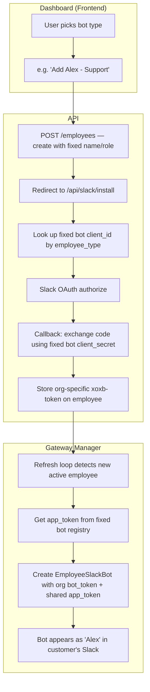

# Fixed Named Bots — Replace Slot-Based Provisioning

## Background

The current system uses **pre-provisioned SlackAppSlots** — a pool of generic Slack app identities that get dynamically assigned to employees. This is complex to manage (you need to manually provision slots, worry about pool exhaustion, etc.).

The new model uses **fixed, named bots** — a small set of pre-registered Slack apps with permanent identities:

| Bot Name | Type | Role |
|----------|------|------|
| **Alison** | `hr` | HR Specialist |
| **Alex** | `support` | Customer Support |
| **Marcus** | `sales` | Sales Representative |
| **Jordan** | `general` | General Assistant |
| **Taylor** | `legal-compliance` | Legal & Compliance Officer |

Each bot is a real Slack app with its own `client_id`, `client_secret`, and `app_token`. The same bot name appears across all orgs — e.g., every customer who adds HR gets "Alison" in their workspace.

> [!IMPORTANT]
> **Slack App Registration**: You'll need to manually create **5 Slack apps** in [api.slack.com/apps](https://api.slack.com/apps) — one per employee type — with the correct names, avatars, and Socket Mode enabled. Their credentials go into environment variables (not a DB pool).

---

## User Review Required

> [!IMPORTANT]
> **Bot Names & Count**: The plan assumes 5 fixed bots matching the 4 existing employee types + legal-compliance. Are these the right names and types? Should we add/remove any?

> [!WARNING]
> **Breaking Change**: This removes the `slack_app_slots` table and the slot assignment machinery entirely. Any existing slots in production will need to be migrated. Existing per-employee OAuth tokens remain valid since they're stored on the employee row.

> [!IMPORTANT]
> **Onboarding Flow Change**: Currently users go to `/onboard`, pick a type, name it, and customize it. The new flow would be: user picks a bot type (e.g., "Add Alex — Support") → system creates the employee with the fixed name/role → redirects to Slack OAuth to install that bot into their workspace. Do you want users to still be able to customize the name/role/duties, or should it be fully fixed (same name, same config everywhere)?

---

## Open Questions

1. **Should users be able to rename the bots?** e.g., if they add Alex (Support), can they rename it to "Sam" in their org? Or is the name fixed globally?

2. **One bot per org, or can an org add multiple of the same type?** Current system enforces one-per-type via unique index. The new system naturally continues this — you can only install Alison (HR) once per org.

3. **Credentials storage**: Currently slots store `client_id`, `client_secret_enc`, `app_token_enc` in the DB. The new plan stores them in **environment variables** (simpler, no DB pool management). Is that acceptable? It means all 5 bots' credentials live in `.env`.

4. **Avatar / profile images**: Should each bot have a distinct avatar? You'll set these in the Slack app config directly at api.slack.com.

---

## Proposed Changes

### 1. New Fixed Bot Registry (API)

#### [NEW] [fixed_bots.py](file:///mnt/work/PROJECTS/openhuman/apps/api/app/gateway/fixed_bots.py)

A static registry mapping `employee_type` → fixed bot credentials. Replaces the DB-backed `SlackAppSlot` pool.

```python
# Registry of fixed Slack bot identities
FIXED_BOTS = {
    "hr": {
        "name": "Alison",
        "role": "HR Specialist",
        "slack_app_id": "",      # from env
        "client_id": "",         # from env  
        "client_secret": "",     # from env
        "app_token": "",         # from env
    },
    "support": {
        "name": "Alex",
        "role": "Customer Support Specialist",
        ...
    },
    ...
}
```

Each bot's credentials come from env vars like:
- `SLACK_BOT_HR_CLIENT_ID`, `SLACK_BOT_HR_CLIENT_SECRET`, `SLACK_BOT_HR_APP_TOKEN`
- `SLACK_BOT_SUPPORT_CLIENT_ID`, `SLACK_BOT_SUPPORT_CLIENT_SECRET`, `SLACK_BOT_SUPPORT_APP_TOKEN`
- etc.

---

### 2. Config Changes (API)

#### [MODIFY] [config.py](file:///mnt/work/PROJECTS/openhuman/apps/api/app/core/config.py)

- Add new `slack_identity_mode = "fixed"` option (alongside existing `"shared"` and `"per_employee"`)
- Add env vars for each fixed bot's credentials (15 new settings: 5 bots × 3 credentials each)
- Add a helper property `fixed_bot_credentials` that returns the registry dict
- Deprecate/remove slot-related settings (`slack_slot_pool_threshold`, `slack_config_token`, `slack_config_refresh_token`)

---

### 3. Simplified OAuth Flow (API)

#### [MODIFY] [slack_oauth.py](file:///mnt/work/PROJECTS/openhuman/apps/api/app/gateway/slack_oauth.py)

- In the `/install` endpoint: when `slack_identity_mode == "fixed"`, look up the employee's `employee_type` → get the fixed bot's `client_id` from the registry → build the OAuth URL with that client_id
- In the `/oauth/callback` endpoint: look up the employee's type → get the fixed bot's `client_secret` from registry → exchange the code → store the org-specific `xoxb-` token on the employee row
- No slot assignment/release needed — the bot identity is static

---

### 4. Updated Employee Service (API)

#### [MODIFY] [service.py](file:///mnt/work/PROJECTS/openhuman/apps/api/app/employees/service.py)

- In `create_employee`: when `slack_identity_mode == "fixed"`, set the employee name and role from the fixed bot registry (override whatever the user sent). No slot assignment.
- In `delete_employee`: no slot release needed for fixed mode
- Remove slot-related imports for the fixed path

#### [MODIFY] [templates.py](file:///mnt/work/PROJECTS/openhuman/apps/api/app/employees/templates.py)

- Update template names to match the fixed bot names (e.g., HR_TEMPLATE.name = "Alison")
- Map each template to its fixed bot identity

---

### 5. Updated Gateway Manager (API)

#### [MODIFY] [manager.py](file:///mnt/work/PROJECTS/openhuman/apps/api/app/gateway/manager.py)

- Add `_reconcile_slack_bots_fixed()` method — similar to `per_employee` but gets the `app_token` from the fixed bot registry instead of a DB slot
- Each employee still gets its own `EmployeeSlackBot` instance (one Socket Mode connection per org-employee) — the bot token is org-specific (from OAuth), the app token is shared (from the fixed registry)

---

### 6. Redesigned Onboarding (Frontend)

#### [MODIFY] [page.tsx](file:///mnt/work/PROJECTS/openhuman/apps/web/app/(dashboard)/onboard/page.tsx)

Complete redesign of the onboarding flow:

**Current flow**: Pick type → Enter name → Enter role → Add duties → Upload docs → Submit

**New flow**: 
1. **Bot picker grid** — show the fixed bots as cards with avatars, names, and descriptions (e.g., "Alison — HR Specialist", "Alex — Customer Support")
2. Disabled/greyed-out if that type is already deployed
3. Click a bot → single-click creates the employee with fixed name/role
4. Immediately redirect to Slack OAuth install (`/api/slack/install?employee_id=...&org_id=...`)
5. After OAuth callback → redirect to dashboard with success toast

This makes onboarding a **one-click** action: pick a bot → it installs into your Slack.

#### [MODIFY] [page.tsx (setup)](file:///mnt/work/PROJECTS/openhuman/apps/web/app/setup/page.tsx)

- After org creation, show the bot picker instead of just knowledge upload
- Flow: Create Org → Pick your first bot → Slack OAuth → Dashboard

---

### 7. Migration

#### [NEW] Alembic migration

- Drop the `slack_app_slots` table (data migration: extract any assigned slot credentials and log them)
- Remove `slack_slot_id` FK column from `employees` table
- Add `fixed_bot_type` column to `employees` if needed (or reuse existing `employee_type`)

> [!CAUTION]
> The migration drops the `slack_app_slots` table. Make sure to back up any production data before running.

---

### 8. Files to Delete/Deprecate

#### [DELETE] [slack_app_provisioning.py](file:///mnt/work/PROJECTS/openhuman/apps/api/app/gateway/slack_app_provisioning.py)

The entire slot provisioning module becomes unnecessary — `assign_slot_to_employee`, `release_slot`, `count_available_slots`, `insert_slot` are all replaced by static config lookups.

#### [MODIFY] [models.py (gateway)](file:///mnt/work/PROJECTS/openhuman/apps/api/app/gateway/models.py)

- Remove or deprecate the `SlackAppSlot` model (after migration drops the table)

#### [MODIFY] [models.py (employees)](file:///mnt/work/PROJECTS/openhuman/apps/api/app/employees/models.py)

- Remove `slack_slot_id` column and the `slack_slot` relationship
- Remove the `SlackAppSlot` TYPE_CHECKING import

---

## Architecture Summary



---

## Verification Plan

### Automated Tests
- Unit test: Fixed bot registry returns correct credentials per type
- Unit test: OAuth flow uses correct client_id/secret per employee type
- Unit test: Employee creation in fixed mode sets correct name/role
- Integration test: Full OAuth flow → employee activation → gateway picks up bot

### Manual Verification
- Create a test Slack app with Socket Mode enabled
- Configure one fixed bot's env vars
- Create an employee via the dashboard → verify OAuth flow → verify bot appears in Slack
- Test that two different orgs can both install the same bot (e.g., both get "Alex") and each gets their own isolated conversations
