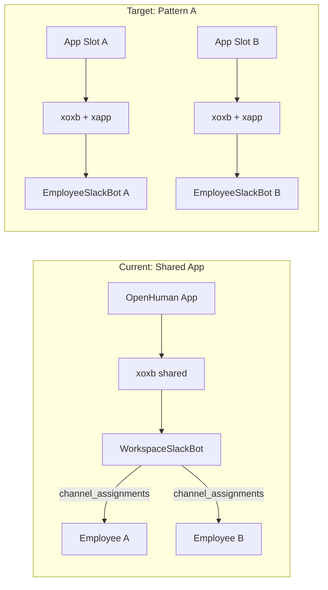

# Pattern A: One Slack App Per AI Employee

> Migrate from one shared OpenHuman Slack app with channel routing to Pattern A: one Slack app (and distinct bot identity) per employee. Phase 1 uses a pre-provisioned app slot pool for fast onboarding; Phase 2 adds dynamic app creation via Slack's Manifest API. Gateway reverts to per-employee Socket Mode bots (like Discord).

## Decisions

- **Provisioning:** Hybrid — slot pool for MVP, manifest API when pool is exhausted
- **Enterprise Grid:** Out of v1 scope (standard single-workspace OAuth only)

## Current state vs target

**Today** ([`apps/api/app/gateway/slack_oauth.py`](../../apps/api/app/gateway/slack_oauth.py), [`manager.py`](../../apps/api/app/gateway/manager.py), [`slack_bot.py`](../../apps/api/app/gateway/slack_bot.py)):

- One global Slack app (`SLACK_CLIENT_ID`, `SLACK_APP_TOKEN`) for all employees
- OAuth stores `xoxb-` on `employees.slack_token_enc`
- Re-installing the same app to the same workspace yields the **same** bot token → multiple employees share one token
- Gateway runs **one** `WorkspaceSlackBot` per unique token and routes via `channel_assignments`
- Identity is faked at reply time with `chat:write.customize` (`username=employee_name`)

**Target (Pattern A)**:

- Each employee has its own Slack app → own bot user, sidebar entry, @mention, DMs, avatar/name
- Each employee has its own `xoxb-` (workspace install) **and** its own `xapp-` (Socket Mode)
- Gateway runs **one bot per employee** (mirror Discord model in [`manager.py`](../../apps/api/app/gateway/manager.py))
- `channel_assignments` become optional scope filters, not identity routing



---

## Key Slack platform constraints (research)

| Constraint | Implication |
|------------|-------------|
| `xapp-` tokens are **per-app**, not per-workspace | Cannot share one `SLACK_APP_TOKEN` globally; each employee app needs its own |
| `xapp-` tokens are **not** returned by OAuth | Must be captured at app creation time (pool provisioning) or generated manually |
| `apps.manifest.create` returns `client_id` + `client_secret` only | Config token (`xoxe-`) needed; expires in 12h unless rotation is wired |
| Manifest API rate limit: Tier 1 (~1/min) | Dynamic creation must be queued; pool avoids signup-time latency |
| `org_deploy_enabled` (Grid) | Out of v1 scope; standard workspace OAuth only |

---

## Phase 1 — Slot pool + per-employee gateway (MVP)

### 1. New data model

Add `slack_app_slots` table (Alembic migration):

```python
# slack_app_slots
id: UUID PK
slack_app_id: str          # e.g. "A012ABCD"
client_id: str               # public, not secret
client_secret_enc: Text      # encrypted
app_token_enc: Text          # xapp-... encrypted
status: str                  # 'available' | 'assigned' | 'disabled'
employee_id: UUID | None FK  # set when assigned
assigned_at: datetime | None
created_at: datetime
```

Extend `employees` table:

```python
slack_team_id: str | None      # from OAuth team.id — persist workspace binding
slack_team_name: str | None
slack_bot_user_id: str | None  # from auth_test after connect
slack_slot_id: UUID | None FK  # → slack_app_slots.id
```

Keep `employees.slack_token_enc` as the workspace bot token (`xoxb-`).

**Slot assignment rule:** one slot ↔ one employee, 1:1. On employee delete, release slot back to `available` (optionally revoke workspace install via `auth.revoke`).

### 2. Ops provisioning script

New CLI: [`apps/api/scripts/provision_slack_slots.py`](../../apps/api/scripts/provision_slack_slots.py)

For each slot (repeat N times, e.g. 20):

1. Create app from [`slack_manifest.json`](../../apps/api/slack_manifest.json) template in Slack UI **or** via `apps.manifest.create` (batch job, respects 1/min limit)
2. In Slack app settings: enable Socket Mode, generate `xapp-` with `connections:write`
3. Insert row into `slack_app_slots` with encrypted `client_secret_enc` + `app_token_enc`

Manifest template per slot uses generic name initially (e.g. `OpenHuman Agent {slot_num}`); display name is updated on assignment.

Env additions in [`config.py`](../../apps/api/app/core/config.py):

- `SLACK_CONFIG_TOKEN` / `SLACK_CONFIG_REFRESH_TOKEN` — for Phase 2 manifest API (store encrypted, rotate via `tooling.tokens.rotate`)
- `SLACK_IDENTITY_MODE` — `per_employee` | `shared` (feature flag for safe rollout)
- Deprecate global `SLACK_CLIENT_ID`, `SLACK_CLIENT_SECRET`, `SLACK_APP_TOKEN` when mode is `per_employee`

### 3. Employee lifecycle: assign slot on create

In [`employees/service.py`](../../apps/api/app/employees/service.py) `create_employee()`:

1. `SELECT ... FROM slack_app_slots WHERE status='available' LIMIT 1 FOR UPDATE`
2. If none: return 503 / clear UI error ("Slack capacity reached — contact support")
3. Assign slot → set `employee.slack_slot_id`
4. Call `apps.manifest.update` (or defer to background job) to set `features.bot_user.display_name` = `employee.name`

New service module: [`apps/api/app/gateway/slack_app_provisioning.py`](../../apps/api/app/gateway/slack_app_provisioning.py)

- `assign_slot_to_employee(db, employee) -> SlackAppSlot`
- `release_slot(db, employee)`
- `build_manifest(employee) -> dict` — parameterized from [`slack_manifest.json`](../../apps/api/slack_manifest.json)
- `update_slot_display_name(slot, employee_name)` — manifest update

### 4. OAuth flow changes

Update [`slack_oauth.py`](../../apps/api/app/gateway/slack_oauth.py):

**`GET /api/slack/install`**

- Load employee + joined `slack_app_slot`
- If no slot: redirect with `slack=error&reason=no_slot`
- Build authorize URL with **slot's** `client_id` (not global `settings.slack_client_id`)
- Keep existing JWT state pattern

**`GET /api/slack/oauth/callback`**

- Decode state → load employee + slot
- Exchange code with **slot's** `client_secret`
- Store on employee:
  - `slack_token_enc` = `xoxb-`
  - `slack_team_id` = `oauth_response.team.id`
  - `slack_team_name` = `oauth_response.team.name`
- Optionally auto-set `status = active` (fixes current gap where OAuth doesn't activate)
- Redirect to dashboard with `slack=connected`

Redirect URI stays **one shared callback** (`/api/slack/oauth/callback`) — register it on every slot app manifest.

### 5. Gateway refactor: per-employee bots

Revert Slack side of [`manager.py`](../../apps/api/app/gateway/manager.py) to mirror Discord:

```python
# Target structure
self.slack_bots: dict[UUID, EmployeeSlackBot]  # keyed by employee_id
```

**`refresh_bots()` Slack path:**

- For each active employee with `slack_token_enc` + assigned slot with `app_token_enc`:
  - Decrypt both tokens
  - Start/reconcile `EmployeeSlackBot(employee_id, bot_token, app_token)`
- Stop bots for deactivated/deleted employees

Refactor [`slack_bot.py`](../../apps/api/app/gateway/slack_bot.py):

- Rename `WorkspaceSlackBot` → `EmployeeSlackBot`
- Constructor: `(employee_id, bot_token, app_token)` — single employee
- Remove `_resolve_employee()` multi-employee routing
- Keep optional channel filter: if employee has `channel_assignments`, only respond in those channels + DMs; if none, respond everywhere (current unrestricted behavior for single employee)
- Remove `chat:write.customize` username override (bot already has correct display name)
- Remove debug `print()` statements

This aligns with [`docs/BigPicture.md`](../BigPicture.md) ("slack-bolt — N apps") and fixes stale tests that already expect `EmployeeSlackBot`.

### 6. Frontend onboarding UX

Update [`apps/web/app/(dashboard)/dashboard/[id]/page.tsx`](../../apps/web/app/(dashboard)/dashboard/[id]/page.tsx):

- Wire real `org_id` from API (not hardcoded `"demo-org"`)
- Show per-employee Slack status:
  - `No slot` → capacity message
  - `Slot assigned, not connected` → **"Add {employee.name} to Slack"** button (deep-link to `/api/slack/install?...`)
  - `Connected` → show workspace name + bot online status
- Post-OAuth: handle `?slack=connected&employee_id=` (already partially there)

**One-click flow for user:**

1. Create employee "Aria" → slot auto-assigned, bot renamed to "Aria"
2. Click "Add Aria to Slack" → Slack OAuth consent (scopes pre-filled, app already exists)
3. Approve → token stored → employee activated → bot appears in sidebar as "Aria"

Subsequent employees in the **same org/workspace** each get their own OAuth grant (different app = different consent screen), but it is a single "Allow" click — no manifest wizard.

### 7. Migration for existing data

- Employees with tokens under old shared-app model: mark `slack_token_enc = NULL`, prompt re-connect
- Add migration note in deploy runbook
- Keep `SLACK_IDENTITY_MODE=shared` flag to run old path during transition if needed

---

## Phase 2 — Dynamic manifest API (unlimited scale)

Add when pool exhaustion becomes a real problem.

### New background job: `provision_slack_app_for_employee`

Triggered when pool is empty (or proactively for enterprise tiers):

1. `apps.manifest.validate(manifest)` in CI + at runtime
2. `apps.manifest.create(manifest)` → get `app_id`, `client_id`, `client_secret`
3. **xapp gap:** Slack does not return `xapp-` from manifest create. Options:
   - **Recommended:** Internal admin step or semi-automated script that opens Slack app settings to generate `xapp-`, then API completes slot row
   - **Future:** Monitor Slack API for app-level token automation
4. Insert new `slack_app_slots` row, assign to employee
5. Queue respects 1/min rate limit

### Config token rotation service

New background task in [`slack_app_provisioning.py`](../../apps/api/app/gateway/slack_app_provisioning.py):

- Store `SLACK_CONFIG_REFRESH_TOKEN` encrypted in DB or secrets manager
- Call `tooling.tokens.rotate` before expiry
- Update stored config token

### Pool monitoring

- Admin endpoint: `GET /api/admin/slack-slots` — available/assigned counts
- Alert when `available < threshold` (e.g. 5)

---

## What we are explicitly NOT doing in v1

- **Enterprise Grid `org_deploy_enabled`** — no org-level OAuth, no multi-workspace token
- **Per-agent avatars via API** — Slack manifest does not reliably support custom icons programmatically; v1 uses `display_name` only; avatar upload is a follow-up via Slack app settings or future API
- **Removing `channel_assignments`** — still useful to limit which channels each employee monitors

---

## Files to create / modify

| Action | File |
|--------|------|
| Create | `apps/api/app/gateway/models.py` — `SlackAppSlot` model |
| Create | `apps/api/app/gateway/slack_app_provisioning.py` — slot assign/release, manifest build |
| Create | `apps/api/scripts/provision_slack_slots.py` — ops batch provisioning |
| Create | Alembic migration — `slack_app_slots` + employee Slack metadata columns |
| Modify | `apps/api/app/gateway/slack_oauth.py` — per-slot OAuth |
| Modify | `apps/api/app/gateway/manager.py` — per-employee Slack bots |
| Modify | `apps/api/app/gateway/slack_bot.py` — `EmployeeSlackBot` |
| Modify | `apps/api/app/employees/service.py` — slot assignment on create/delete |
| Modify | `apps/api/app/employees/schemas.py` — `slack_team_name`, `has_slack_slot` |
| Modify | `apps/api/app/core/config.py` — new env vars, identity mode flag |
| Modify | `apps/api/slack_manifest.json` — template with placeholder `display_name` |
| Modify | `apps/web/app/(dashboard)/dashboard/[id]/page.tsx` — real org_id, slot status UX |
| Update | `apps/api/tests/test_gateway.py`, `test_slack_oauth.py` — match new architecture |
| Update | `docs/BigPicture.md`, `docs/LANGGRAPH_WORKFLOW.md` — remove outdated shared-token docs |

---

## Implementation todos

- [ ] Add `slack_app_slots` table + employee Slack metadata columns (Alembic migration)
- [ ] Create `slack_app_provisioning.py`: slot assign/release, manifest template, display name update
- [ ] Create `provision_slack_slots.py` ops script to batch-create N slot apps with xapp tokens
- [ ] Refactor `slack_oauth.py` to use per-slot client_id/secret and persist team_id
- [ ] Refactor `manager.py` + `slack_bot.py` to `EmployeeSlackBot` (one Socket Mode connection per employee)
- [ ] Wire slot assignment on employee create/delete in `employees/service.py`
- [ ] Update dashboard Connect Slack UX with real org_id and slot/connection status
- [ ] Add dynamic `apps.manifest.create` job + config token rotation when pool is exhausted
- [ ] Update gateway/oauth tests and architecture docs for per-employee identity model

---

## Scaling considerations

- **Socket Mode connections:** N active employees = N WebSocket connections in one API process (same as N Discord bots today). Monitor memory/FD limits; shard gateway to separate worker if N > ~50.
- **Slack app limit:** Slack allows many apps per developer account; pool of 20–50 is fine for early customers.
- **OAuth per employee per workspace:** Unavoidable for distinct identities. Pool removes app-creation friction; OAuth remains one admin click per agent.

---

## Test plan

1. Provision 3 slots via ops script; verify encrypted storage
2. Create employee → slot assigned, manifest display name updated
3. OAuth install → `slack_token_enc`, `slack_team_id` persisted
4. Gateway starts `EmployeeSlackBot` with correct `xoxb` + `xapp` pair
5. Two employees in same workspace: distinct @mentions route to correct LangGraph employee
6. Delete employee → slot released to `available`
7. Pool exhausted → create employee returns clear error
8. Feature flag `SLACK_IDENTITY_MODE=shared` still runs old path (regression safety)
